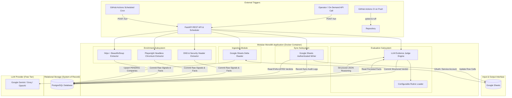
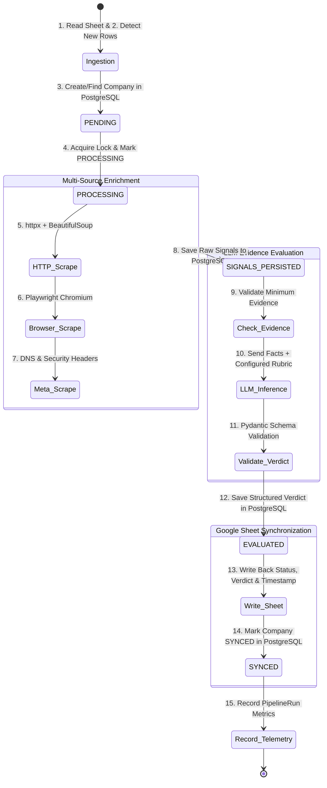
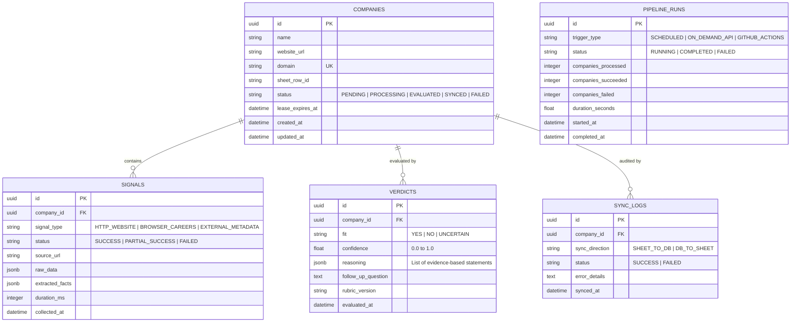

# Autonomous Company Intelligence Agent

> An automated, evidence-based intelligence pipeline that ingests company lists from Google Sheets, collects multi-source signals (including live Playwright browser automation), executes deductive reasoning via an LLM Judge against a configurable evaluation rubric, persists all evidence in PostgreSQL, and synchronizes structured verdicts back to Google Sheets.

---

## 1. Problem Statement

Evaluating prospective target companies, sales leads, or investment targets requires significant manual labor:
1. **Time-Consuming Manual Investigation:** Sales Development Representatives (SDRs) and analysts spend hours visiting company websites, hunting for career pages to determine tech stack maturity and hiring velocity, and verifying corporate infrastructure.
2. **Modern Dynamic Websites (SPAs):** Many technology companies build websites using single-page application (SPA) frameworks (React, Next.js, Vue) or embed career boards (Greenhouse, Lever, Ashby) that return blank HTML to traditional HTTP scrapers.
3. **Subjective & Inconsistent Analysis:** Human evaluations against Ideal Customer Profiles (ICPs) often suffer from fatigue, uncalibrated confidence, and lack of structured evidence citations.
4. **Data Sync Fragmentation:** Managing company evaluation queues in spreadsheets without a relational system of record leads to data corruption, lost historical context, and accidental overwrites.

The **Company Intelligence Agent** solves this by automating the entire lifecycle—from spreadsheet ingestion to live browser signal extraction, evidence-grounded LLM judgment, database persistence, and bi-directional spreadsheet synchronization.

---

## 2. What It Does

The system operates as a continuous, deterministic data processing loop:

```
┌─────────────────┐       ┌─────────────────┐       ┌─────────────────┐
│  Google Sheet   │──────▶│   Multi-Source  │──────▶│   PostgreSQL    │
│  (Input Queue)  │       │   Enrichment    │       │ (System Record) │
└─────────────────┘       └─────────────────┘       └────────┬────────┘
                                                             │
┌─────────────────┐       ┌─────────────────┐                │
│  Google Sheet   │◀──────│    LLM Judge    │◀───────────────┘
│ (Verdict Sync)  │       │ (Evidence Synth)│
└─────────────────┘       └─────────────────┘
```

1. **Ingestion:** Reads target company rows from an authenticated Google Sheet and identifies new or unprocessed rows without requiring application restarts.
2. **Multi-Source Enrichment:** Dispatches parallel collectors to gather independent signals:
   - **HTTP & Metadata:** Fast static HTML, meta tags, OpenGraph, and Schema.org JSON-LD via `httpx` and `BeautifulSoup4`.
   - **Live Browser Automation:** Dynamic JavaScript rendering, SPA hydration, and career/job opening extraction via headless Chromium using `Playwright`.
   - **External Infrastructure:** DNS MX records (email provider), SPF/DMARC status, and TLS certificate metadata.
3. **Deterministic Persistence:** All raw signals and distilled facts are **committed to PostgreSQL in `jsonb` *before* LLM evaluation**, guaranteeing auditability and replayability.
4. **LLM Evidence Judgment:** An LLM Judge evaluates the persisted facts against a **Configurable Evaluation Rubric**, generating a structured verdict (`fit: YES|NO|UNCERTAIN`, `confidence: 0.0-1.0`, `reasoning: List[str]`, and `follow_up_question`).
5. **Spreadsheet Sync:** Synchronizes the verdict, confidence score, evidence reasoning summary, follow-up discovery question, and timestamp back to the Google Sheet.

---

## 3. System Architecture

The application is structured as a **Modular Monolith**—combining clean internal module boundaries with zero distributed-system overhead and low memory footprints suited for free-tier cloud containers.



### Module Boundary Overview
- **`app/ingestion/`**: Authenticated Google Sheets reading and row delta change detection.
- **`app/enrichment/`**: Independent signal extractors (`http_collector.py`, `browser_collector.py`, `metadata_collector.py`).
- **`app/db/`**: PostgreSQL models (`Company`, `Signal`, `Verdict`, `SyncLog`, `PipelineRun`), SQLAlchemy 2.0 engine, Alembic migrations.
- **`app/llm/`**: `LLMClient` protocol, dynamic prompt assembly, Pydantic v2 structured output validation, and 1-shot repair handler.
- **`app/orchestration/`**: 15-step pipeline coordinator, state transitions, and concurrency lease locks.
- **`app/sync/`**: Authenticated Google Sheets batch write-back engine.
- **`app/api/`**: FastAPI REST endpoints, `X-API-Key` security, and background task scheduling.

---

## 4. Tech Stack & Selection Rationale

| Technology | Role | Justification & Rationale |
| :--- | :--- | :--- |
| **Python 3.11+** | Core Language | Industry standard for async web scrapers, data pipelines, and LLM integrations. |
| **FastAPI** | REST API Framework | High-performance asynchronous request handling, native Pydantic validation, and auto-generated Swagger UI at `/docs`. |
| **PostgreSQL** | Relational Database | ACID transactions, foreign keys, and `jsonb` support for auditability; serves as the true **System of Record**. |
| **SQLAlchemy 2.0** | ORM & Query Layer | Modern async session management (`asyncpg`) and strong typing. |
| **Alembic** | Database Migrations | Version-controlled, reproducible schema migrations. |
| **Pydantic v2** | Data Modeling & Validation | Strict schema enforcement for normalized signals, LLM outputs, and API payloads. |
| **httpx** | Async HTTP Client | Fast, non-blocking requests with HTTP/2 and connection pooling for static scraping. |
| **BeautifulSoup4** | HTML Parser | Lightweight DOM extraction of titles, meta tags, headings, and schema.org JSON-LD. |
| **Playwright** | Browser Automation | Headless Chromium engine for client-side JavaScript execution, dynamic SPA hydration, and ATS job board scraping. |
| **Google Sheets API v4** | External I/O Interface | Familiar spreadsheet interface for non-technical operators and sales workflows. |
| **LLM APIs (Gemini / Groq)** | Reasoning Engine | Zero-shot structured evidence synthesis with zero-cost free tiers. |
| **pytest** | Test Framework | Deterministic unit, integration, and mock testing with `pytest-asyncio` and `respx`. |
| **Docker & Docker Compose** | Packaging & Local Dev | Multi-stage image packaging Chromium dependencies and local PostgreSQL orchestration. |
| **GitHub Actions** | CI/CD & Automation | Automated test runs on push/PR and scheduled workflow triggers. |

> [!IMPORTANT]
> **Explicit Architecture Exclusions:**
> - **NO Firecrawl:** All extraction is handled natively using `httpx`, `BeautifulSoup`, and `Playwright` to ensure 100% free-tier operation and eliminate third-party API dependencies.
> - **NO LangChain / LangGraph:** Replaced by clean, deterministic Python SDK calls and Pydantic validators, eliminating dependency bloat and obscure stack traces.
> - **NO Microservices:** Avoids network latency, RPC complexity, and memory overhead on free-tier single-container hosting.

---

## 5. Company Processing Pipeline (15-Step Lifecycle)

Every company record advances through a deterministic 15-step state machine:



### Persistence-First Guarantee
**Evidence is staged and committed to PostgreSQL *before* invoking the LLM Judge.** If an LLM provider experiences an outage, no scraped data is lost, and evaluations can be retried instantly without re-crawling the web.

---

## 6. Database Schema (PostgreSQL System of Record)



---

## 7. Browser Automation with Playwright

Playwright is used to perform **genuine browser automation** rather than executing plain HTTP calls:

1. **Client-Side Rendering (SPAs):** Navigates to modern React/Vue/Next.js corporate and career websites, waiting for `domcontentloaded` and network idle states to allow JavaScript hydration.
2. **Interactive Element Evaluation:** Inspects dynamic career widgets, embedded ATS portals (Greenhouse, Lever, Ashby, Workable), and expandable job listings.
3. **Extracted Career Signals:**
   - Active job openings count.
   - Hiring distribution across departments (Engineering, Sales, Product).
   - Tech stack mentions detected directly in job requirement descriptions (e.g., `Python`, `FastAPI`, `PostgreSQL`, `Docker`, `AWS`).
   - Remote work and team growth posture.
4. **Resource Management:** Headless Chromium is executed with `--disable-dev-shm-usage` and throttled via an `asyncio.Semaphore(2)` to protect container memory on free-tier hosting.

---

## 8. LLM Judge Subsystem (Configurable Evidence Reasoning)

The LLM Judge acts as an analytical synthesizer, **never performing web browsing itself**.

### Structured Output Schema:
```json
{
  "fit": "YES",
  "confidence": 0.92,
  "reasoning": [
    "Company offers an enterprise B2B SaaS platform with multi-tenant architecture.",
    "Careers page reveals 6 active engineering positions mentioning Python, PostgreSQL, and Docker.",
    "Verified corporate infrastructure with active Google Workspace email and valid DMARC records."
  ],
  "follow_up_question": "What is their current integration timeline for enterprise ERP connectors?"
}
```

### Configurable Fit Criteria:
Because specific business fit criteria vary, **no business assumptions are hardcoded**. Criteria are configured via `config/rubric.yaml` and `.env` overrides:
- Target profile specifications (e.g., B2B SaaS, enterprise tooling).
- Explicit positive indicators.
- Disqualifying negative indicators.
- Confidence calibration guidelines.

---

## 9. REST API Reference

All operational endpoints (except `/health`) require authentication via the `X-API-Key: <YOUR_KEY>` header.

| Method | Endpoint | Description | Auth |
| :--- | :--- | :--- | :--- |
| `GET` | `/health` | Liveness & readiness probe (DB latency, browser status, LLM config). | Public |
| `POST` | `/run` | Trigger on-demand ingestion and evaluation batch (`202 Accepted`). | Required |
| `GET` | `/runs/{run_id}` | Query execution telemetry, progress counters, and error summaries. | Required |
| `GET` | `/companies` | Query persisted companies with pagination, status filters, and search. | Required |
| `GET` | `/companies/{id}` | Retrieve complete company profile, raw signals, and latest verdict. | Required |
| `POST` | `/companies/{id}/retry` | Force an immediate isolated re-evaluation for a single company. | Required |

---

## 10. Automation & Scheduling

1. **Scheduled Background Execution:** An internal scheduler triggers periodic batch runs at configured cron intervals (e.g., daily or hourly).
2. **On-Demand API Triggers:** External services or operators can initiate runs on-demand by sending an authenticated `POST /run` request.
3. **GitHub Actions Workflows:**
   - **`ci.yml`**: Runs `ruff` code formatting checks and `pytest` test suites on every `push` and `pull_request` to `main`.
   - **`pipeline_trigger.yml`**: Dispatches scheduled and manual one-click pipeline runs against the deployed public instance.

---

## 11. Deployment Architecture

```
Local Development:
Docker Compose ──▶ FastAPI (with Playwright Chromium) ──▶ PostgreSQL 16 Container

Production (Free-Tier Cloud):
Docker Container ──▶ Render / Koyeb / Fly.io ──▶ Public HTTPS Endpoint (https://app.domain.com)
                                             ──▶ Managed PostgreSQL (Free Tier)
```

- **Containerization:** Multi-stage `Dockerfile` based on `python:3.11-slim` with system Chromium libraries and non-root `appuser`.
- **Zero-Cost Constraints:** Designed to run reliably within 512MB–1GB RAM and 5-connection database limits.

---

## 12. Local Setup & Installation

### Prerequisites
- Python 3.11+
- Docker & Docker Compose (optional, for containerized run)
- Google Cloud Service Account JSON key (with Sheets & Drive APIs enabled)
- Free-tier Google Gemini or Groq API key

### Quickstart (Docker Compose)
1. **Clone the repository:**
   ```bash
   git clone https://github.com/your-username/company-intelligent-agent.git
   cd company-intelligent-agent
   ```
2. **Configure environment variables:**
   ```bash
   cp .env.example .env
   # Edit .env and supply your GOOGLE_SERVICE_ACCOUNT_JSON, GOOGLE_SHEET_ID, and GEMINI_API_KEY
   ```
3. **Start the application & database:**
   ```bash
   docker compose up --build -d
   ```
4. **Verify service health:**
   ```bash
   curl http://localhost:8000/health
   ```
5. **Open API documentation:**
   Visit `http://localhost:8000/docs` in your browser.

---

## 13. Environment Variables Reference

| Variable | Required | Default | Description |
| :--- | :--- | :--- | :--- |
| `APP_ENV` | Yes | `development` | Runtime environment (`development`, `production`). |
| `PORT` | No | `8000` | HTTP port for Uvicorn web server. |
| `LOG_LEVEL` | No | `INFO` | Logging verbosity (`DEBUG`, `INFO`, `WARNING`). |
| `API_KEY` | Yes (prod) | `dev-insecure-key` | Secret key for authenticating protected API endpoints. |
| `DATABASE_URL` | Yes | N/A | PostgreSQL async connection string. |
| `GOOGLE_SERVICE_ACCOUNT_JSON`| Yes | N/A | Full Google Service Account credentials JSON string. |
| `GOOGLE_SHEET_ID` | Yes | N/A | Spreadsheet ID from the Google Sheet URL. |
| `GOOGLE_SHEET_WORKSHEET_NAME`| No | `Sheet1` | Target worksheet tab name. |
| `LLM_PROVIDER` | No | `gemini` | LLM backend: `gemini`, `groq`, or `openai`. |
| `GEMINI_API_KEY` | If Gemini | N/A | Free-tier Google AI Studio API key. |
| `GROQ_API_KEY` | If Groq | N/A | Free-tier Groq Cloud API key. |
| `OPENAI_API_KEY` | If OpenAI | N/A | OpenAI API key. |
| `MAX_CONCURRENT_BROWSERS` | No | `2` | Max concurrent Playwright instances (RAM protection). |
| `RUBRIC_CONFIG_PATH` | No | `config/rubric.yaml` | Path to evaluation rubric configuration. |

---

## 14. Testing

Run the full automated test suite using `pytest`:

```bash
# Run all unit and integration tests
pytest -v

# Run with test coverage report
pytest -v --cov=app --cov-report=term-missing

# Run specific test modules
pytest tests/test_enrichment_browser.py
pytest tests/test_llm_judge.py
pytest tests/test_api.py
```

---

## 15. Limitations & Operational Boundaries

1. **Anti-Bot Defenses:** Websites protected by aggressive bot challenges (Cloudflare Turnstile, DataDome, hard CAPTCHAs) may block Playwright scraping. The system handles this gracefully by relying on available static HTTP and DNS signals with adjusted confidence.
2. **Free-Tier Concurrency:** Container memory limits (512MB RAM) cap concurrent browser sessions to 2 instances, requiring serial or small-batch processing.
3. **LLM Rate Limits:** Free-tier LLM endpoints enforce rate limits (e.g., 15 RPM for Gemini). The system incorporates automatic exponential backoff with jitter to stay within quotas.
4. **Google Sheets Quotas:** Google Sheets v4 API limits read/write requests to 300 per minute per project. Batch writes are used to conserve quota.

---

## 16. Key Design Decisions

1. **Modular Monolith over Microservices:** Eliminates distributed networking failures, serialized RPC latency, and multi-container orchestration costs on free-tier infrastructure.
2. **PostgreSQL Staging Before LLM Evaluation:** Eliminates token waste and data loss by persisting all raw signals *prior* to calling the LLM Judge.
3. **Exclusion of Third-Party Scraper APIs (Firecrawl):** Eliminates vendor lock-in and paid credit exhaustion by implementing lightweight native scrapers with `httpx`, `BeautifulSoup`, and `Playwright`.
4. **Pure Python & Pydantic over LangChain:** Maximizes maintainability, transparency, and execution speed while eliminating breaking abstraction layers.

---

## 17. Suggested 3–5 Minute Demonstration Flow

For the required project demonstration video:

1. **Step 1: Input Setup in Google Sheets (0:00 – 0:45)**
   - Display the Google Sheet containing sample companies with blank status and verdict columns.
   - Add a new company row (e.g., a modern B2B SaaS startup) to demonstrate dynamic ingestion without restarting the server.
2. **Step 2: Triggering the Pipeline (0:45 – 1:30)**
   - Send an authenticated `POST /run` request via Swagger UI (`http://localhost:8000/docs`) or curl.
   - Show the immediate `202 Accepted` response with the unique `run_id`.
3. **Step 3: Live Signal Extraction & Playwright in Action (1:30 – 2:30)**
   - Show terminal logs showing parallel extraction across `httpx`, `BeautifulSoup`, `dnspython`, and headless Chromium via `Playwright`.
   - Highlight the dynamic extraction of career postings, active roles, and tech stack keywords.
4. **Step 4: Database Inspection & Evidence Staging (2:30 – 3:30)**
   - Query PostgreSQL to show that raw signals, dynamic DOM extracts, and facts were safely staged in the `signals` table *before* LLM evaluation.
   - Show the structured verdict stored in the `verdicts` table.
5. **Step 5: Live Google Sheet Synchronization (3:30 – 4:15)**
   - Return to the Google Sheet and show the updated row: Status (`SYNCED`), Fit Call (`YES`/`NO`/`UNCERTAIN`), Confidence Score, Reasoning Summary, Follow-up Discovery Question, and Evaluation Timestamp.
6. **Step 6: Querying the REST API & Summary (4:15 – 5:00)**
   - Call `GET /companies/{id}` and `GET /runs/{run_id}` to show queryability on demand.
   - Conclude with a summary of the zero-cost, containerized architecture.

---
*End of Documentation.*
