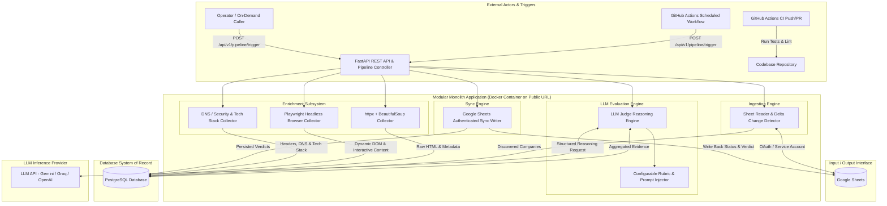
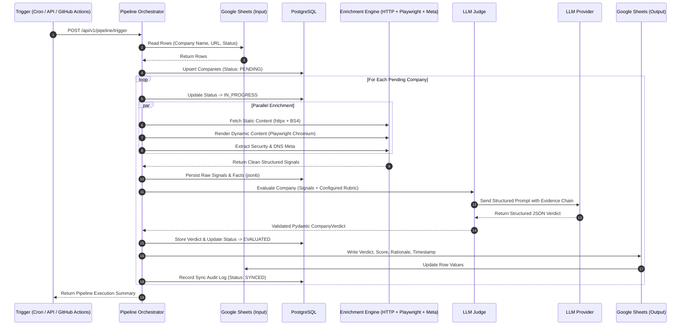
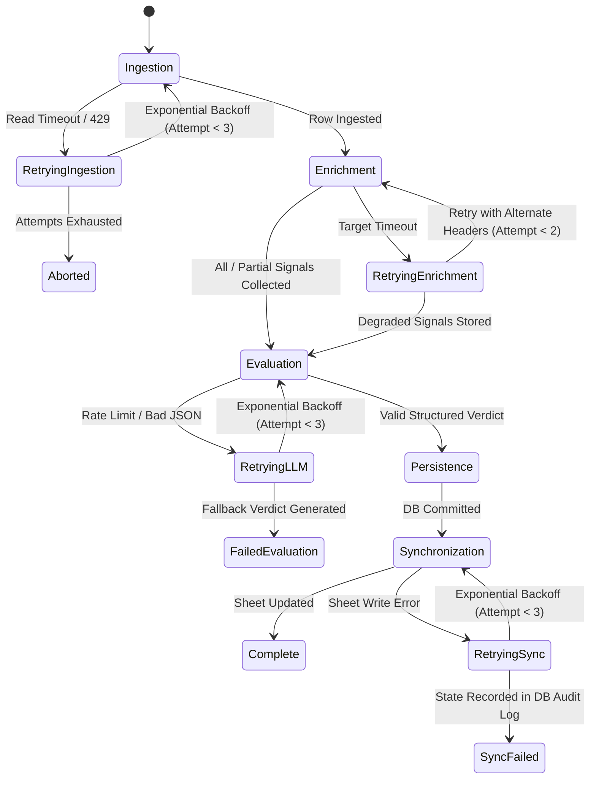
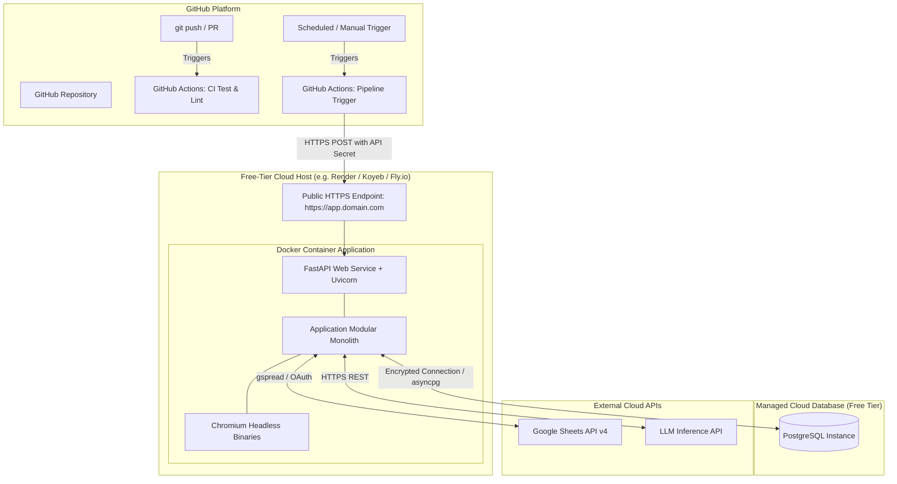

# System Architecture: Autonomous Company Intelligence Agent

> **Status:** Approved Architecture Design  
> **Pattern:** Modular Monolith  
> **Target Specification:** [`docs/PROJECT_SPEC.md`](file:///c:/Users/Lenovo/Desktop/company-intelligent%20agent/docs/PROJECT_SPEC.md)

---

## 1. Architectural Style & Philosophy

The system is architected as a **Modular Monolith**. 

All functional domains—Ingestion, Pipeline Orchestration, Multi-Source Enrichment, Database Persistence, LLM Evaluation, and Google Sheets Synchronization—reside within a single deployable Python codebase and runtime. Distinct boundaries are enforced between internal modules using clean interfaces and Pydantic Data Transfer Objects (DTOs).

```
┌─────────────────────────────────────────────────────────────────────────────┐
│                           MODULAR MONOLITH BOUNDARY                         │
│                                                                             │
│  ┌──────────────┐    ┌──────────────────┐    ┌───────────────────────────┐  │
│  │  Ingestion   │───▶│   Orchestrator   │───▶│    Enrichment Subsystem   │  │
│  │   (Sheets)   │    │  (FastAPI Core)  │    │ (HTTP, Playwright, Meta)  │  │
│  └──────────────┘    └─────────┬────────┘    └─────────────┬─────────────┘  │
│                                │                           │                │
│                                ▼                           ▼                │
│                      ┌───────────────────────────────────────────┐          │
│                      │       PostgreSQL Persistence Layer        │          │
│                      └─────────────────┬─────────────────────────┘          │
│                                        │                                    │
│                                        ▼                                    │
│  ┌──────────────┐    ┌───────────────────────────────────────────┐          │
│  │  Sheet Sync  │◀───│            LLM Judge Subsystem            │          │
│  │   (Writer)   │    │        (Reasoning & Verdict Synth)        │          │
│  └──────────────┘    └───────────────────────────────────────────┘          │
└─────────────────────────────────────────────────────────────────────────────┘
```

### Core Design Principles
1. **High Cohesion, Low Coupling:** Each module owns its domain logic (e.g., scraping mechanics are completely encapsulated within Enrichment; database session semantics are encapsulated in Persistence).
2. **Explicit Data Contracts:** Inter-module communication relies exclusively on typed Pydantic models.
3. **Deterministic Persistence Before Reasoning:** All raw signals must be staged in PostgreSQL *before* LLM evaluation, ensuring complete auditability and replayability.
4. **Resilience & Graceful Degradation:** Failure of a single signal source does not abort the pipeline; the LLM reasons over available evidence and adjusts confidence accordingly.
5. **Zero-Cost Operability:** Designed to execute within free-tier container limits without external paid APIs.

---

## 2. High-Level System Diagram



---

## 3. Component Breakdown & Responsibilities

| Component | Directory / Package | Core Responsibility |
| :--- | :--- | :--- |
| **API & Routing** | `app/api/` | Exposes REST endpoints for pipeline triggers, queryable company/verdict status, health probes, and OpenAPI documentation. |
| **Pipeline Orchestrator** | `app/orchestration/` | Coordinates the end-to-end execution lifecycle, enforces state transitions (`INGESTED` → `ENRICHED` → `EVALUATED` → `SYNCED`), and handles batching. |
| **Ingestion Engine** | `app/ingestion/` | Authenticates with Google Sheets API via Service Account, parses target rows, computes content hashes, and identifies un-evaluated or newly added rows. |
| **HTTP Enrichment** | `app/enrichment/http_collector.py` | Executes fast, concurrent HTTP requests via `httpx` and parses structured elements (titles, meta tags, schema.org JSON-LD, body text) with `BeautifulSoup4`. |
| **Browser Enrichment** | `app/enrichment/browser_collector.py` | Launches headless Chromium via `Playwright` to navigate target URLs, execute client-side JavaScript, wait for network idle/DOM hydration, and extract dynamic content (SPAs, pricing tables, interactive widgets). |
| **Metadata/DNS Enrichment**| `app/enrichment/metadata_collector.py` | Gathers independent signals: HTTP security headers, DNS records, server signatures, and OpenGraph metadata to provide distinct third-source evidence. |
| **PostgreSQL Persistence** | `app/db/` | Manages relational entities (`Company`, `Signal`, `Verdict`, `SyncLog`), connection pooling via `SQLAlchemy 2.0`, and schema migrations via `Alembic`. |
| **LLM Judge Subsystem** | `app/llm/` | Compiles raw evidence, injects the configurable evaluation rubric, formats structured prompts, and validates LLM output into `FitCall`, `Confidence`, `Evidence Reasoning`, and `Follow-up Question`. |
| **Google Sheets Sync** | `app/sync/` | Formats final verdicts and writes results, scores, rationale, and timestamps back to the corresponding rows in Google Sheets. |
| **Configuration & Core** | `app/core/` | Centralized settings management (`pydantic-settings`), logging, error handling, and retry decorators. |

---

## 4. Architectural Rationale & Key Architectural Decisions

### 4.1 Why PostgreSQL is the Source of Truth
- **Data Integrity & Relational Modeling:** Evaluated companies produce multi-layered data (multiple raw signals per run, historical verdicts over time, and sync audit logs). A relational database provides foreign keys, unique constraints, and ACID transactions that Google Sheets cannot support.
- **Auditability & Replayability:** Raw HTML payloads, dynamic DOM extracts, and LLM reasoning chains are stored permanently in `jsonb` columns. If business criteria change, historical data can be re-evaluated without re-scraping the web.
- **Protection Against Accidental Modification:** Google Sheets is prone to human error (accidental row deletions, sorting errors, overwrite mistakes). Storing state in PostgreSQL guarantees that operational state is never lost or corrupted.

### 4.2 Why Google Sheets is the Input/Output Interface
- **Zero-Friction Collaboration:** Non-technical operators can add target companies, view fit calls, and read follow-up discovery questions without needing direct database access or custom frontends.
- **Native Ecosystem Integration:** Allows operators to trigger external downstream workflows, share evaluation summaries with sales teams, and filter results directly in familiar spreadsheet software.

### 4.3 Why Playwright is Required
- **Modern JavaScript Execution (SPAs):** A substantial percentage of modern company websites are built on React, Next.js, Vue, or Angular, where initial HTML payloads contain empty root `<div>` elements. Plain HTTP scrapers fail to extract any meaningful content.
- **Dynamic & Interactive Elements:** Certain critical signals (e.g., dynamic pricing tabs, interactive product demos, expandable FAQ sections) only manifest after client-side hydration or DOM events.
- **Anti-Bot & Header Verification:** Headless Chromium renders real browser headers, passes client-side fingerprinting, and handles redirects naturally.

### 4.4 Why httpx + BeautifulSoup are Used for Normal HTTP Enrichment
- **Speed & Concurrency:** `httpx` provides non-blocking asynchronous HTTP requests capable of fetching dozens of static pages, sitemaps, and robots.txt files in milliseconds.
- **Resource Efficiency:** A headless browser requires ~100–300 MB of RAM per instance. Utilizing `httpx` + `BeautifulSoup` for the primary static crawl conserves precious memory and CPU cycles on free-tier container instances.

### 4.5 Why FastAPI is Used
- **Native Asynchrony (`async`/`await`):** Essential for non-blocking I/O operations across HTTP scraping, database pooling (`asyncpg`), Google Sheets API calls, and LLM inference.
- **Strict Data Validation:** First-class integration with Pydantic v2 ensures all incoming payloads and outgoing verdicts adhere to schema contracts.
- **Auto-Generated Documentation:** Produces standard OpenAPI / Swagger interactive documentation at `/docs` with zero extra boilerplate.

### 4.6 Why the LLM is Separated from Enrichment
- **Decoupling Determinism from Reasoning:** Signal extraction is deterministic (fetching bytes and extracting text). LLM evaluation is analytical (synthesizing facts against a rubric). Coupling them creates brittle code that is difficult to test and debug.
- **Cost & Token Optimization:** Pre-processing and cleaning HTML into structured facts *before* sending them to the LLM reduces prompt token consumption by up to 90% and eliminates prompt-injection vectors embedded in raw web markup.
- **Independent Failure Domains:** A failure during web scraping can be retried independently without incurring redundant LLM API costs.

### 4.7 Why We Are NOT Using LangChain / LangGraph
- **Avoid Over-Abstraction & Bloat:** LangChain introduces deeply nested call stacks, brittle abstractions, high memory footprints, and frequent breaking changes between releases.
- **Deterministic Control:** The evaluation pipeline requires a single, well-defined structured reasoning call over pre-aggregated evidence. Pure Python with direct SDK calls (or LiteLLM) and Pydantic output validation provides 100% transparency, immediate debugging, and zero dependency overhead.

### 4.8 Why We Are NOT Using Firecrawl
- **Strict Free-Tier & Independence Requirement:** Firecrawl is a paid commercial third-party service. Relying on it introduces vendor lock-in, credit exhaustion risks, and external dependency failure.
- **Direct Control Over Scraping Logic:** In-house orchestration of `httpx`, `BeautifulSoup`, and `Playwright` allows custom DOM filtering, precise timeout tuning, and localized headless execution without third-party data transmission.

### 4.9 Why We Are NOT Using Microservices
- **Resource Constraints of Free-Tier Hosting:** Microservices require multiple containers, service discovery, inter-service networking, and distributed logging, which exceed free-tier quotas.
- **Elimination of Distributed Failure Modes:** In a single-team, focused pipeline, in-memory function calls and local transactions eliminate network latency, serialization overhead, distributed transactions, and out-of-sync service versions.

---

## 5. End-to-End Data Flow



---

## 6. Failure Flow & Resilience Strategy

The system is designed with multi-layered fault isolation to prevent pipeline halts:

```mermaid
graph TD
    A[Start Company Processing] --> B{Google Sheet Read Success?}
    B -- No --> B_FAIL[Log Sync Failure -> Alert & Abort Batch]
    B -- Yes --> C[Dispatch Parallel Signal Collectors]

    C --> D{HTTP Collector Success?}
    C --> E{Playwright Collector Success?}
    C --> F{Metadata Collector Success?}

    D -- Failure --> D_FALLBACK[Capture Error Signal -> Continue]
    E -- Failure --> E_FALLBACK[Capture Error Signal -> Continue]
    F -- Failure --> F_FALLBACK[Capture Error Signal -> Continue]

    D_FALLBACK & E_FALLBACK & F_FALLBACK & D & E & F --> G{At Least One Signal Available?}
    G -- No --> G_FAIL[Set Status: EXTRACTION_FAILED -> Record in DB & Sheet]
    G -- Yes --> H[Persist Available Signals to PostgreSQL]

    H --> I{LLM API Inference Success?}
    I -- Rate Limit / Error --> I_RETRY[Exponential Backoff Retry (Max 3)]
    I_RETRY --> I
    I_RETRY -- Exhausted --> I_FAIL[Set Status: EVALUATION_FAILED -> Fallback Verdict]

    I -- Success --> J[Validate Pydantic Schema]
    J -- Schema Error --> J_RETRY[Re-prompt LLM with Formatting Fix]
    J -- Valid --> K[Persist Verdict to PostgreSQL]

    K --> L{Google Sheet Write Success?}
    L -- Failure --> L_RETRY[Retry Write (Max 3)]
    L_RETRY -- Exhausted --> L_LOG[Log SYNC_FAILED in DB -> Sheet Unaffected]
    L -- Success --> M[Mark Company SYNCED in DB]
```

### Specific Failure Strategies
1. **Partial Enrichment Failure:** If Playwright crashes or times out on a heavy website, the HTTP and Metadata signals are still retained. The LLM is explicitly informed of missing signals and adjusts its `confidence_score` accordingly.
2. **LLM Transient Failures & Rate Limits:** Wrapped with exponential backoff and jitter. If an LLM provider is entirely down, the company is marked `EVALUATION_FAILED` with the raw signals safely preserved in PostgreSQL for instant replay.
3. **Google Sheets API Quota:** Read and write operations are throttled and batched to respect Google Sheets v4 API quotas (300 requests per minute per project).

---

## 7. Retry Flow & Circuit Breakers



---

## 8. Deployment Architecture & Infrastructure



### 8.1 Docker Container Packaging
- Multi-stage build based on official `python:3.11-slim`.
- System dependencies for Playwright Chromium (`libnss3`, `libatk1.0-0`, `libxcomposite1`, `libxdamage1`, `libcups2`, etc.).
- Dedicated non-root user (`appuser`) for secure container runtime.
- Environment variables injected securely via host dashboard / repository secrets.

### 8.2 GitHub Actions Pipeline Automation
- **Continuous Integration (`.github/workflows/ci.yml`):** Runs `ruff` for linting and code formatting checks, followed by `pytest` running the full test suite with mocked external boundaries on every push.
- **Automated Pipeline Trigger (`.github/workflows/pipeline_trigger.yml`):** Configured with cron expressions (e.g., daily schedule) and `workflow_dispatch` (manual one-click trigger). Sends an authenticated request to `POST https://<PUBLIC_URL>/api/v1/pipeline/trigger`.

---
*End of Architecture Document.*
