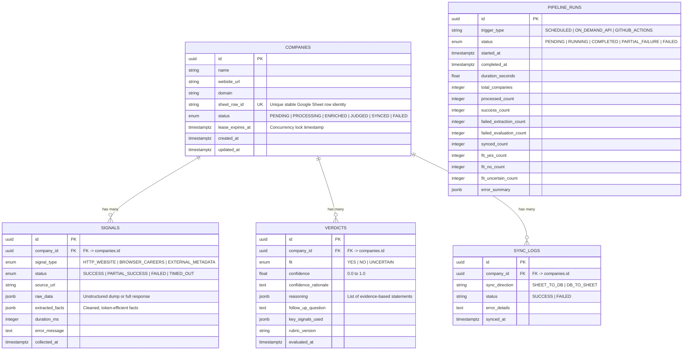

# PostgreSQL Relational Data Model Specification

> **Status:** Approved Database Specification  
> **Architecture Reference:** [`docs/ARCHITECTURE.md`](file:///c:/Users/Lenovo/Desktop/company-intelligent%20agent/docs/ARCHITECTURE.md)  
> **Pipeline Reference:** [`docs/PIPELINE.md`](file:///c:/Users/Lenovo/Desktop/company-intelligent%20agent/docs/PIPELINE.md)  
> **LLM Judge Reference:** [`docs/LLM_SPEC.md`](file:///c:/Users/Lenovo/Desktop/company-intelligent%20agent/docs/LLM_SPEC.md)

---

## 1. System of Record Principles

PostgreSQL serves as the **isolated single source of truth (System of Record)** for all company metadata, collected evidence signals, historical evaluations, sync audit trails, and pipeline telemetry.

Google Sheets functions solely as a human-facing input/output interface and is never treated as the database.

---

## 2. Entity Relationship Diagram (ERD)

---

## 3. Entity Definitions & Table Specifications

### 3.1 `companies` Table
Represents a company discovered from the Google Sheet.

| Column | Type | Constraints | Description |
| :--- | :--- | :--- | :--- |
| `id` | `UUID` | `PRIMARY KEY`, Default: `gen_random_uuid()` | Internal unique database identifier. |
| `name` | `VARCHAR(255)` | `NOT NULL` | Company name from the Google Sheet. |
| `website_url` | `VARCHAR(1024)` | `NOT NULL` | Target website URL. |
| `domain` | `VARCHAR(255)` | `NULLABLE`, Indexed | Normalized domain (e.g. `acme.io`) for deduplication. |
| `sheet_row_id` | `VARCHAR(128)` | `NOT NULL`, `UNIQUE`, Indexed | Stable row identifier (e.g., `row_2`, `row_3`) guaranteeing idempotent ingestion. |
| `status` | `VARCHAR(32)` | `NOT NULL`, Indexed, Default: `'PENDING'` | State: `PENDING`, `PROCESSING`, `ENRICHED`, `JUDGED`, `SYNCED`, `FAILED`. |
| `lease_expires_at`| `TIMESTAMPTZ` | `NULLABLE` | Lease expiration for atomic multi-worker concurrency locking. |
| `created_at` | `TIMESTAMPTZ` | `NOT NULL`, Default: `NOW()` | Creation timestamp. |
| `updated_at` | `TIMESTAMPTZ` | `NOT NULL`, Default: `NOW()` | Last modification timestamp. |

---

### 3.2 `signals` Table
Represents one independently collected piece of evidence for a company.

| Column | Type | Constraints | Description |
| :--- | :--- | :--- | :--- |
| `id` | `UUID` | `PRIMARY KEY`, Default: `gen_random_uuid()` | Unique signal identifier. |
| `company_id` | `UUID` | `NOT NULL`, `FOREIGN KEY REFERENCES companies(id) ON DELETE CASCADE`, Indexed | Parent company reference. |
| `signal_type` | `VARCHAR(64)` | `NOT NULL`, Indexed | Provider type (`HTTP_WEBSITE`, `BROWSER_CAREERS`, `EXTERNAL_METADATA`). |
| `status` | `VARCHAR(32)` | `NOT NULL` | Extraction status (`SUCCESS`, `PARTIAL_SUCCESS`, `FAILED`, `TIMED_OUT`). |
| `source_url` | `VARCHAR(1024)` | `NOT NULL` | Source URL or endpoint from which data was retrieved. |
| `raw_data` | `JSONB` | `NULLABLE` | Full unstructured payload/dump for debugging & auditability. |
| `extracted_facts` | `JSONB` | `NOT NULL`, Default: `'{}'` | Cleaned, token-efficient facts passed to LLM reasoning engine. |
| `duration_ms` | `INTEGER` | `NULLABLE` | Duration of the extraction call in milliseconds. |
| `error_message` | `TEXT` | `NULLABLE` | Error stack or message if extraction failed or timed out. |
| `collected_at` | `TIMESTAMPTZ` | `NOT NULL`, Default: `NOW()` | Timestamp when signal was recorded. |

---

### 3.3 `verdicts` Table
Represents the LLM structured evaluation judgment for a company.

| Column | Type | Constraints | Description |
| :--- | :--- | :--- | :--- |
| `id` | `UUID` | `PRIMARY KEY`, Default: `gen_random_uuid()` | Unique verdict identifier. |
| `company_id` | `UUID` | `NOT NULL`, `FOREIGN KEY REFERENCES companies(id) ON DELETE CASCADE`, Indexed | Target company reference. |
| `fit` | `VARCHAR(32)` | `NOT NULL`, Indexed | Evaluated fit verdict (`YES`, `NO`, `UNCERTAIN`). |
| `confidence` | `DOUBLE PRECISION`| `NOT NULL` | Calibrated confidence score between `0.0` and `1.0`. |
| `confidence_rationale` | `TEXT` | `NULLABLE` | Rationale for the assigned confidence score. |
| `reasoning` | `JSONB` | `NOT NULL` | JSON array of deductive, evidence-grounded statements. |
| `follow_up_question` | `TEXT` | `NULLABLE` | Targeted discovery question for ambiguous or incomplete evidence. |
| `key_signals_used` | `JSONB` | `NULLABLE` | List of signal types cited in the reasoning chain. |
| `rubric_version` | `VARCHAR(64)` | `NULLABLE` | Version identifier of `config/rubric.yaml` used during inference. |
| `evaluated_at` | `TIMESTAMPTZ` | `NOT NULL`, Default: `NOW()`, Indexed | Timestamp when judgment was performed. |

---

### 3.4 `sync_logs` Table
Tracks bi-directional synchronization attempts to Google Sheets.

| Column | Type | Constraints | Description |
| :--- | :--- | :--- | :--- |
| `id` | `UUID` | `PRIMARY KEY`, Default: `gen_random_uuid()` | Unique log identifier. |
| `company_id` | `UUID` | `NOT NULL`, `FOREIGN KEY REFERENCES companies(id) ON DELETE CASCADE`, Indexed | Associated company ID. |
| `sync_direction` | `VARCHAR(32)` | `NOT NULL` | Sync flow direction (`SHEET_TO_DB` or `DB_TO_SHEET`). |
| `status` | `VARCHAR(32)` | `NOT NULL`, Indexed | Synchronization outcome (`SUCCESS` or `FAILED`). |
| `error_details` | `TEXT` | `NULLABLE` | API quota or payload error details if sync failed. |
| `synced_at` | `TIMESTAMPTZ` | `NOT NULL`, Default: `NOW()` | Timestamp of the sync attempt. |

---

### 3.5 `pipeline_runs` Table
Tracks execution telemetry for scheduled and on-demand pipeline batches.

| Column | Type | Constraints | Description |
| :--- | :--- | :--- | :--- |
| `id` | `UUID` | `PRIMARY KEY`, Default: `gen_random_uuid()` | Unique pipeline run identifier. |
| `trigger_type` | `VARCHAR(64)` | `NOT NULL` | Trigger source (`SCHEDULED`, `ON_DEMAND_API`, `GITHUB_ACTIONS`). |
| `status` | `VARCHAR(32)` | `NOT NULL`, Indexed | Execution status (`PENDING`, `RUNNING`, `COMPLETED`, `PARTIAL_FAILURE`, `FAILED`). |
| `started_at` | `TIMESTAMPTZ` | `NOT NULL`, Default: `NOW()`, Indexed | Run initiation timestamp. |
| `completed_at` | `TIMESTAMPTZ` | `NULLABLE` | Run completion timestamp. |
| `duration_seconds` | `DOUBLE PRECISION`| `NULLABLE` | Total run duration in seconds. |
| `total_companies` | `INTEGER` | `NOT NULL`, Default: `0` | Total companies detected for processing. |
| `processed_count` | `INTEGER` | `NOT NULL`, Default: `0` | Companies attempted. |
| `success_count` | `INTEGER` | `NOT NULL`, Default: `0` | Companies successfully evaluated. |
| `failed_extraction_count` | `INTEGER` | `NOT NULL`, Default: `0` | Companies where signal extraction failed. |
| `failed_evaluation_count` | `INTEGER` | `NOT NULL`, Default: `0` | Companies where LLM evaluation failed. |
| `synced_count` | `INTEGER` | `NOT NULL`, Default: `0` | Companies synced back to Google Sheets. |
| `fit_yes_count` | `INTEGER` | `NOT NULL`, Default: `0` | Companies evaluated as `YES`. |
| `fit_no_count` | `INTEGER` | `NOT NULL`, Default: `0` | Companies evaluated as `NO`. |
| `fit_uncertain_count` | `INTEGER` | `NOT NULL`, Default: `0` | Companies evaluated as `UNCERTAIN`. |
| `error_summary` | `JSONB` | `NULLABLE` | Summary list of errors encountered during the run. |

---

## 4. Idempotency & Uniqueness Strategy

1. **Google Sheet Row Identity (`sheet_row_id`):** 
   - A unique constraint and index are placed on `companies.sheet_row_id`.
   - Subsequent ingestion cycles query existing companies by `sheet_row_id`. If a company already exists, the record is updated rather than duplicated.
2. **Deterministic Upsert Queries:**
   - Ingestion uses PostgreSQL `ON CONFLICT (sheet_row_id) DO UPDATE SET updated_at = NOW(), website_url = EXCLUDED.website_url`.
3. **Lease Locking for Concurrency Protection:**
   - When a worker claims a company for processing, it updates `status = 'PROCESSING'` and sets `lease_expires_at = NOW() + INTERVAL '5 minutes'`.
   - Concurrent workers ignore rows where `status = 'PROCESSING'` and `lease_expires_at > NOW()`.

---
*End of Data Model Specification.*
