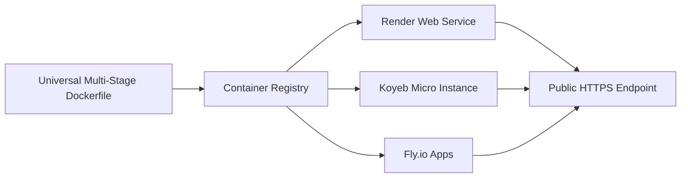
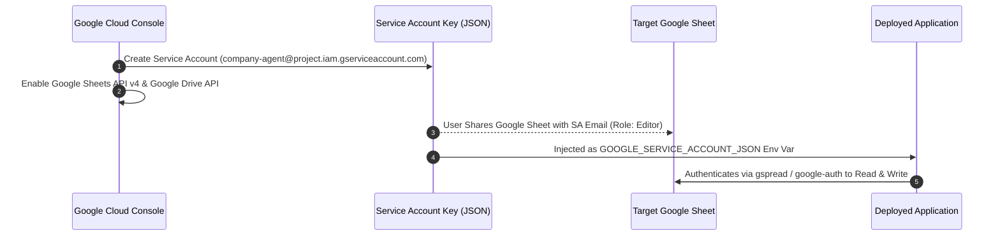

# Deployment Architecture & Operational Runbook

> **Status:** Approved Deployment Architecture  
> **Target System:** Company Intelligence Agent  
> **References:** [`docs/PROJECT_SPEC.md`](file:///c:/Users/Lenovo/Desktop/company-intelligent%20agent/docs/PROJECT_SPEC.md), [`docs/ARCHITECTURE.md`](file:///c:/Users/Lenovo/Desktop/company-intelligent%20agent/docs/ARCHITECTURE.md), [`docs/API_SPEC.md`](file:///c:/Users/Lenovo/Desktop/company-intelligent%20agent/docs/API_SPEC.md)

---

## 1. Deployment Topology Overview

The application is deployed across two target environments: **Local Development** (Docker Compose with local PostgreSQL) and **Production** (Multi-stage Docker container on free-tier cloud hosting with managed PostgreSQL and a public HTTPS endpoint).

```
┌─────────────────────────────────────────────────────────────────────────────┐
│                          LOCAL DEPLOYMENT TOPOLOGY                          │
│                                                                             │
│                     ┌────────────────────────────────┐                      │
│                     │       Host Machine Browser     │                      │
│                     └───────────────┬────────────────┘                      │
│                                     │ http://localhost:8000                 │
│                                     ▼                                       │
│    ┌───────────────────────────────────────────────────────────────────┐    │
│    │                  Docker Compose Bridge Network                    │    │
│    │                                                                   │    │
│    │  ┌─────────────────────────────┐  ┌────────────────────────────┐  │    │
│    │  │        api Service          │  │         db Service         │  │    │
│    │  │  - FastAPI + Uvicorn        │  │  - PostgreSQL 16 Alpine    │  │    │
│    │  │  - Playwright Chromium      │◀─┼─▶ - Persistent Named       │  │    │
│    │  │  - Non-root user (appuser)  │  │     Volume (postgres_data) │  │    │
│    │  └─────────────────────────────┘  └────────────────────────────┘  │    │
│    └───────────────────────────────────────────────────────────────────┘    │
└─────────────────────────────────────────────────────────────────────────────┘

┌─────────────────────────────────────────────────────────────────────────────┐
│                       PRODUCTION DEPLOYMENT TOPOLOGY                        │
│                                                                             │
│    ┌───────────────────────────┐         ┌─────────────────────────────┐    │
│    │  External Traffic / CRON  │         │ GitHub Actions (Trigger WS) │    │
│    └─────────────┬─────────────┘         └──────────────┬──────────────┘    │
│                  │                                      │                   │
│                  │ HTTPS Request (X-API-Key)            │                   │
│                  ▼                                      ▼                   │
│    ┌───────────────────────────────────────────────────────────────────┐    │
│    │                 Public Load Balancer / SSL Edge                   │    │
│    │               (https://<YOUR-APP-SUBDOMAIN>.domain)               │    │
│    └─────────────────────────────────┬─────────────────────────────────┘    │
│                                      │                                      │
│                                      ▼                                      │
│    ┌───────────────────────────────────────────────────────────────────┐    │
│    │                Free-Tier Cloud Container Service                  │    │
│    │                    (Render / Koyeb / Fly.io)                      │    │
│    │                                                                   │    │
│    │  ┌─────────────────────────────────────────────────────────────┐  │    │
│    │  │ Application Docker Container                                │  │    │
│    │  │  - FastAPI HTTP Web Server (Port 8000)                      │  │    │
│    │  │  - Embedded Playwright Chromium Runtime                     │  │    │
│    │  │  - Background Ingestion & Sync Engine                       │  │    │
│    │  └──────────────────────────────┬──────────────────────────────┘  │    │
│    └─────────────────────────────────┼─────────────────────────────────┘    │
│                                      │                                      │
│                 ┌────────────────────┴────────────────────┐                 │
│                 ▼                                         ▼                 │
│    ┌─────────────────────────┐               ┌─────────────────────────┐    │
│    │  Managed PostgreSQL DB  │               │   External Cloud APIs   │    │
│    │  (Free-Tier Cloud Host) │               │ - Google Sheets API v4  │    │
│    │  - SSL Encrypted Link   │               │ - LLM API (Gemini/Groq) │    │
│    └─────────────────────────┘               └─────────────────────────┘    │
└─────────────────────────────────────────────────────────────────────────────┘
```

---

## 2. Environment Variables & Secret Configuration

To prevent security vulnerabilities, **NO SECRETS MAY BE COMMITTED TO GIT**. All credentials are provided exclusively via `.env` locally or injected through the cloud hosting provider's environment variables dashboard.

### 2.1 Complete Variable Reference

| Variable Name | Required | Default | Example Value | Description |
| :--- | :--- | :--- | :--- | :--- |
| **`APP_ENV`** | Yes | `development` | `production` | Runtime mode: `development`, `testing`, `production`. |
| **`PORT`** | No | `8000` | `8000` | Port for the Uvicorn web server. |
| **`LOG_LEVEL`** | No | `INFO` | `INFO` / `DEBUG` | Logging verbosity level. |
| **`API_KEY`** | **Yes (in prod)** | `dev-insecure-key` | `ak_live_8f7b3c2e1a...` | Secret key for authenticating protected API endpoints. |
| **`DATABASE_URL`** | **Yes** | N/A | `postgresql+asyncpg://user:pass@db:5432/agent_db` | Async SQLAlchemy PostgreSQL connection string. |
| **`DB_POOL_SIZE`** | No | `5` | `5` | Connection pool size (kept low for free-tier DB limits). |
| **`DB_MAX_OVERFLOW`** | No | `5` | `5` | Allowed overflow connections. |
| **`GOOGLE_SERVICE_ACCOUNT_JSON`** | **Yes** | N/A | `{"type": "service_account", ...}` | Complete Google Service Account JSON string. |
| **`GOOGLE_SHEET_ID`** | **Yes** | N/A | `1BxiMVs0XR...` | Google Sheet ID (from the spreadsheet URL). |
| **`GOOGLE_SHEET_WORKSHEET_NAME`** | No | `Sheet1` | `Companies` | Name of the specific worksheet tab to ingest/sync. |
| **`LLM_PROVIDER`** | No | `gemini` | `gemini` / `groq` / `openai` | Active LLM inference provider. |
| **`GEMINI_API_KEY`** | If Gemini | N/A | `AIzaSyB...` | Google AI Studio free-tier API key. |
| **`GROQ_API_KEY`** | If Groq | N/A | `gsk_...` | Groq Cloud free-tier API key. |
| **`OPENAI_API_KEY`** | If OpenAI | N/A | `sk-proj-...` | OpenAI API key. |
| **`PLAYWRIGHT_HEADLESS`** | No | `true` | `true` | Run Chromium in headless mode. |
| **`MAX_CONCURRENT_BROWSERS`** | No | `2` | `2` | Max concurrent Playwright contexts to protect container RAM. |
| **`RUBRIC_CONFIG_PATH`** | No | `config/rubric.yaml` | `config/rubric.yaml` | Path to the evaluation criteria rubric file. |

---

## 3. Local Deployment (Docker Compose)

### 3.1 Docker Compose Architecture
The local stack spins up two networked containers:
1. `api`: Builds from the project `Dockerfile`, installs Playwright Chromium, mounts the local codebase for live development, and runs FastAPI via Uvicorn.
2. `db`: Runs standard `postgres:16-alpine` with a persistent named volume.

### 3.2 Local Bootstrap Steps
1. Create your local environment file:
   ```bash
   cp .env.example .env
   ```
2. Populate `.env` with your `GOOGLE_SERVICE_ACCOUNT_JSON`, `GOOGLE_SHEET_ID`, and `GEMINI_API_KEY`.
3. Launch the container stack:
   ```bash
   docker compose up --build -d
   ```
4. Verify database migrations execute automatically on container startup.
5. Verify health:
   ```bash
   curl http://localhost:8000/health
   ```
6. Access interactive API documentation at:
   ```
   http://localhost:8000/docs
   ```

---

## 4. Production Deployment Strategy (Free-Tier Cloud)

### 4.1 Cloud Hosting Provider Isolation
To adhere to the requirement of not relying on guesswork while maintaining provider independence:
- The application is packaged as a standard, self-contained **Open Container Initiative (OCI) Docker image**.
- It can be deployed to any container-compatible free-tier cloud platform (e.g., **Render Web Service**, **Koyeb**, **Fly.io**, or **Railway**).
- Provider-specific configuration manifests (e.g. `render.yaml` or `fly.toml`) are isolated in dedicated deploy scripts without contaminating core application code.



### 4.2 Production Operating Constraints (Free-Tier)
1. **Memory Budget:** Free-tier instances typically provide **512 MB to 1 GB of RAM**.
   - Playwright Chromium is executed with `--disable-dev-shm-usage`, `--no-sandbox`, and `--disable-gpu`.
   - Concurrency is throttled via `MAX_CONCURRENT_BROWSERS=2` to ensure total memory usage stays under 400 MB.
2. **PostgreSQL Connection Limits:** Free-tier managed databases restrict simultaneous connections to **10–20 connections**.
   - Connection pool is configured with `pool_size=5`, `max_overflow=5`, and `pool_recycle=300`.
   - SQLAlchemy `pool_pre_ping=True` is enabled to automatically heal dropped idle connections.

---

## 5. Google Authentication & Sheets Setup



### Setup Instructions:
1. Navigate to **Google Cloud Console** and create a project.
2. Enable **Google Sheets API** and **Google Drive API**.
3. Create a **Service Account** and generate a JSON Key.
4. Open the target Google Sheet and click **Share** → Add the Service Account email with **Editor** permissions.
5. In production, set the environment variable:
   - `GOOGLE_SERVICE_ACCOUNT_JSON`: Paste the entire content of the downloaded JSON file as a single-line string.
   - `GOOGLE_SHEET_ID`: Copy the ID from the sheet URL (`https://docs.google.com/spreadsheets/d/<SPREADSHEET_ID>/edit`).

---

## 6. LLM Provider Authentication & Configuration

The system supports multiple free-tier LLM providers via the unified `LLMClient` abstraction:

1. **Google Gemini (Default & Recommended):**
   - Register at [Google AI Studio](https://aistudio.google.com/) for a free API key.
   - Set `LLM_PROVIDER=gemini` and `GEMINI_API_KEY=<API_KEY>`.
   - Free tier includes generous 15 RPM / 1,000,000 TPM allowances.
2. **Groq Cloud (Alternative):**
   - Register at [Groq Console](https://console.groq.com/) for a free API key.
   - Set `LLM_PROVIDER=groq` and `GROQ_API_KEY=<API_KEY>`.
3. **OpenAI (Alternative):**
   - Set `LLM_PROVIDER=openai` and `OPENAI_API_KEY=<API_KEY>`.

---

## 7. Playwright Headless Browser Container Requirements

To run Playwright reliably inside the Docker container without GUI overhead:

### 7.1 Multi-Stage Dockerfile Architecture
```dockerfile
# Base runtime image
FROM python:3.11-slim as base

ENV PYTHONUNBUFFERED=1 \
    PYTHONDONTWRITEBYTECODE=1 \
    PLAYWRIGHT_BROWSERS_PATH=/ms-playwright

# Install essential system dependencies for Chromium
RUN apt-get update && apt-get install -y --no-install-recommends \
    wget \
    gnupg \
    ca-certificates \
    libnss3 \
    libatk1.0-0 \
    libatk-bridge2.0-0 \
    libcups2 \
    libdrm2 \
    libxkbcommon0 \
    libxcomposite1 \
    libxdamage1 \
    libxfixes3 \
    libxrandr2 \
    libgbm1 \
    libpango-1.0-0 \
    libasound2 \
    && rm -rf /var/lib/apt/lists/*

WORKDIR /app

# Create non-root user
RUN useradd -m -u 1000 appuser && \
    mkdir -p /ms-playwright && \
    chown -R appuser:appuser /ms-playwright /app

# Install dependencies
COPY requirements.txt .
RUN pip install --no-cache-dir -r requirements.txt

# Install Playwright Chromium binary ONLY (saves ~700MB compared to full browser suite)
RUN playwright install --with-deps chromium

USER appuser
COPY --chown=appuser:appuser . .

EXPOSE 8000
CMD ["uvicorn", "app.main:app", "--host", "0.0.0.0", "--port", "8000"]
```

---

## 8. Health Checks & Production Verification

### 8.1 Public Health Check
The deployment platform monitors container readiness and liveness by sending periodic requests to `GET /health`:

```bash
curl -i https://<YOUR-DEPLOYED-APP-URL>/health
```

#### Expected Response:
```json
{
  "status": "healthy",
  "version": "1.0.0",
  "environment": "production",
  "dependencies": {
    "database": { "status": "connected", "latency_ms": 5 },
    "browser_engine": { "status": "ready", "engine": "Chromium (Playwright)" },
    "llm_provider": { "status": "configured", "provider": "gemini" },
    "google_sheets": { "status": "authenticated" }
  },
  "timestamp": "2026-09-01T20:20:00Z"
}
```

### 8.2 End-to-End Trigger Test
Verify on-demand execution on the deployed public instance:
```bash
curl -X POST https://<YOUR-DEPLOYED-APP-URL>/run \
     -H "X-API-Key: <YOUR_PRODUCTION_API_KEY>" \
     -H "Content-Type: application/json" \
     -d '{"batch_size": 5}'
```

---

## 9. Production Troubleshooting & Failure Runbook

| Incident Symptom | Root Cause | Resolution Action |
| :--- | :--- | :--- |
| **`503 Service Unavailable` on `/health`** | PostgreSQL unreachable or connection limit exceeded. | Check managed DB instance status; verify `DB_POOL_SIZE` is <= 5; inspect DB credentials. |
| **Container OOM (Exit Code 137)** | Playwright opened too many concurrent browser pages. | Verify `MAX_CONCURRENT_BROWSERS` is set to `2` or lower; ensure Chromium args include `--disable-dev-shm-usage`. |
| **Google Sheets `403 Forbidden` / `404 Not Found`** | Service Account email not shared on the Google Sheet. | Re-check spreadsheet sharing settings; confirm Service Account email has `Editor` access. |
| **LLM `429 Too Many Requests`** | Free-tier RPM quota reached. | Automatic backoff retry will handle transient spikes; verify batch size is <= 10. |
| **`401 Unauthorized` on `/run`** | Missing or mismatched `X-API-Key`. | Ensure client sends the exact key defined in the production `API_KEY` environment variable. |

---
*End of Deployment Specification.*
