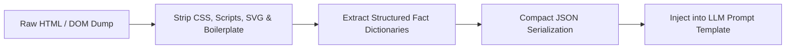

# Company Enrichment Subsystem Specification

> **Status:** Approved Component Specification  
> **Architecture Reference:** [`docs/ARCHITECTURE.md`](file:///c:/Users/Lenovo/Desktop/company-intelligent%20agent/docs/ARCHITECTURE.md)  
> **Pipeline Reference:** [`docs/PIPELINE.md`](file:///c:/Users/Lenovo/Desktop/company-intelligent%20agent/docs/PIPELINE.md)  
> **System Requirements:** [`docs/PROJECT_SPEC.md`](file:///c:/Users/Lenovo/Desktop/company-intelligent%20agent/docs/PROJECT_SPEC.md)

---

## 1. Subsystem Overview & Architectural Boundaries

The **Company Enrichment Subsystem** is responsible for collecting multiple independent signals for each company without relying on paid third-party scraping APIs (such as Firecrawl).

The subsystem is organized into distinct, decoupled enricher providers coordinated by a central orchestrator (`Enricher`). All extracted data is sanitized and transformed into a unified **Normalized Signal** format before persistence in PostgreSQL and synthesis by the LLM Judge.

```
┌─────────────────────────────────────────────────────────────────────────────┐
│                       ENRICHMENT SUBSYSTEM TOPOLOGY                         │
│                                                                             │
│                        ┌──────────────────────┐                             │
│                        │   Enrichment Engine  │                             │
│                        │     (Orchestrator)   │                             │
│                        └──────────┬───────────┘                             │
│                                   │                                         │
│         ┌─────────────────────────┼─────────────────────────┐               │
│         ▼                         ▼                         ▼               │
│  ┌───────────────┐        ┌───────────────┐        ┌──────────────────┐     │
│  │WebsiteEnricher│        │BrowserEnricher│        │ExternalSignal-   │     │
│  │ (httpx + BS4) │        │ (Playwright)  │        │ Enricher (DNS)   │     │
│  └───────┬───────┘        └───────┬───────┘        └────────┬─────────┘     │
│          │                        │                         │               │
│          └────────────────────────┼─────────────────────────┘               │
│                                   ▼                                         │
│                        ┌──────────────────────┐                             │
│                        │ Normalized Signal    │                             │
│                        │ Aggregation & Schema │                             │
│                        └──────────┬───────────┘                             │
│                                   ▼                                         │
│                        ┌──────────────────────┐                             │
│                        │ PostgreSQL (signals) │                             │
│                        └──────────────────────┘                             │
└─────────────────────────────────────────────────────────────────────────────┘
```

---

## 2. Unified Signal Normalization Schema

All enrichers must output data conforming to the standard `NormalizedSignal` contract:

```python
from datetime import datetime
from enum import Enum
from typing import Any, Dict, List, Optional
from uuid import UUID
from pydantic import BaseModel, Field

class SignalType(str, Enum):
    HTTP_WEBSITE = "HTTP_WEBSITE"
    BROWSER_CAREERS = "BROWSER_CAREERS"
    EXTERNAL_METADATA = "EXTERNAL_METADATA"

class SignalStatus(str, Enum):
    SUCCESS = "SUCCESS"
    PARTIAL_SUCCESS = "PARTIAL_SUCCESS"
    FAILED = "FAILED"
    TIMED_OUT = "TIMED_OUT"

class NormalizedSignal(BaseModel):
    signal_type: SignalType
    status: SignalStatus
    source_url: str
    collected_at: datetime = Field(default_factory=datetime.utcnow)
    duration_ms: int
    raw_data: Dict[str, Any] = Field(
        description="Full unstructured extract or structured dumps for debugging/audit"
    )
    extracted_facts: Dict[str, Any] = Field(
        description="Cleaned, token-efficient facts distilled for LLM reasoning"
    )
    error_message: Optional[str] = None

class EnrichmentBundle(BaseModel):
    company_id: UUID
    signals: List[NormalizedSignal]
    total_duration_ms: int
    has_minimum_evidence: bool
```

---

## 3. Provider Specifications

```mermaid
graph TD
    subgraph "Provider 1: WebsiteEnricher"
        A1[Target URL] --> A2[httpx Async GET]
        A2 --> A3[BeautifulSoup4 HTML Parser]
        A3 --> A4[Extract: Meta, JSON-LD, Titles, Hero Copy]
        A4 --> A5[NormalizedSignal: HTTP_WEBSITE]
    end

    subgraph "Provider 2: BrowserEnricher"
        B1[Target / Careers URL] --> B2[Playwright Headless Chromium]
        B2 --> B3[Execute JS & Wait for Hydration]
        B3 --> B4[Extract: Dynamic Careers Widget, Job Counts, Tech Terms]
        B4 --> B5[NormalizedSignal: BROWSER_CAREERS]
    end

    subgraph "Provider 3: ExternalSignalEnricher"
        C1[Domain Name] --> C2[dnspython MX/TXT + TLS Handshake]
        C2 --> C3[Extract: Mail Provider, SSL Issuer, Security Headers]
        C3 --> C4[NormalizedSignal: EXTERNAL_METADATA]
    end
```



---

### 3.1 `WebsiteEnricher` (Static HTTP & HTML Parser)

| Attribute | Specification |
| :--- | :--- |
| **Purpose** | Fast, low-overhead extraction of primary business identity, value propositions, navigation structure, and Schema.org semantic metadata. |
| **Core Technologies** | `httpx.AsyncClient` (HTTP/2 enabled, follow redirects) + `BeautifulSoup4` (lxml parser). |
| **Input** | `website_url: str`, `company_name: str` |
| **Output** | Title, meta description, OpenGraph properties, schema.org JSON-LD entities, H1–H3 heading hierarchy, primary landing page textual content. |
| **Source** | Canonical company website homepage (and `/about` if discovered via navigation). |
| **Signal Type** | `HTTP_WEBSITE` |
| **Timeout Policy** | **10 seconds** (`connect_timeout=3.0s`, `read_timeout=7.0s`). |
| **Retry Behavior** | **2 retries** with exponential backoff (`1s`, `2s`) on connection reset, SSL renegotiation, or 5xx responses. |
| **Failure Behavior** | If failed (e.g. 404, DNS error), records `SignalStatus.FAILED` with status code and error trace. Does not abort the pipeline. |
| **Rate Limiting** | Max 1 concurrent connection per target host. Adheres to standard browser `User-Agent` headers. |

#### Extracted Facts Structure:
```json
{
  "page_title": "Acme Inc - Autonomous Supply Chain AI",
  "meta_description": "Enterprise AI for real-time warehouse orchestration.",
  "headings_summary": ["Autonomous Scheduling", "Fleet Telemetry", "Integrations"],
  "schema_org_types": ["SoftwareApplication", "Organization"],
  "value_proposition": "We eliminate manual dispatch with predictive routing algorithms.",
  "identified_social_links": ["https://linkedin.com/company/acme", "https://github.com/acme"]
}
```

---

### 3.2 `BrowserEnricher` (Genuine Playwright Headless Browser Automation)

> [!IMPORTANT]
> **Real Browser Automation Standard:** This enricher does NOT merely issue an HTTP request via Playwright. It spins up a headless Chromium instance, executes full client-side JavaScript, waits for DOM hydration of dynamic widgets (such as embedded ATS job boards like Greenhouse, Lever, Ashby, or Workable), interacts with DOM elements (e.g. clicking "Open Positions" or scrolling dynamic containers), and extracts live hiring and organizational growth signals.

| Attribute | Specification |
| :--- | :--- |
| **Purpose** | Extract dynamic, client-rendered career and organizational signals to evaluate hiring velocity, engineering growth, and tech stack adoption from active job postings. |
| **Core Technologies** | `playwright.async_api` with Headless Chromium. |
| **Input** | `website_url: str`, optional `careers_url: Optional[str]` |
| **Output** | Total active job openings count, hiring department breakdown (Engineering, Sales, Product), tech stack keywords mentioned in job requirements, and remote work posture. |
| **Source** | Rendered DOM of discovered careers page (`/careers`, `/jobs`, `/join-us`) or embedded ATS iframe/widget. |
| **Signal Type** | `BROWSER_CAREERS` |
| **Timeout Policy** | **20 seconds** total: `page.goto(url, timeout=12000)` + `wait_for_load_state("networkidle", timeout=5000)` + `interaction_timeout=3000`. |
| **Retry Behavior** | **1 retry** with an isolated fresh browser context if Chromium crashes, throws a page-detached error, or times out. |
| **Failure Behavior** | If browser navigation fails (e.g., bot challenge or heavy SPA timeout), catches exception gracefully, saves error snippet, and marks `SignalStatus.FAILED`. |
| **Rate Limiting & Resource Controls** | Restricts concurrent browser contexts via an `asyncio.Semaphore(2)`. Browser contexts are explicitly closed after extraction to prevent RAM leaks. |

#### Extraction Strategy & Interaction Flow:
1. Navigate to target `/careers` or `/jobs` route with `domcontentloaded`.
2. Inspect for embedded job boards (e.g., `<div id="ashby_embed">`, `<iframe src="lever.co">`, or React-rendered listing cards).
3. If listings are behind collapsible tabs or "View All Roles" buttons, trigger lightweight DOM click.
4. Extract job titles, departments, locations, and descriptions.
5. Parse keyword frequencies for technology mentions (e.g., `Python`, `PostgreSQL`, `Kubernetes`, `AWS`, `React`).

#### Extracted Facts Structure:
```json
{
  "careers_page_found": true,
  "careers_url": "https://acme.com/careers",
  "active_jobs_count": 8,
  "hiring_departments": {
    "Engineering": 4,
    "Product": 1,
    "Sales & Marketing": 3
  },
  "tech_stack_detected_in_jobs": ["Python", "FastAPI", "PostgreSQL", "Docker", "AWS"],
  "remote_work_policy": "Hybrid / Remote-friendly",
  "seniority_focus": ["Senior Backend Engineer", "Lead Data Scientist"]
}
```

---

### 3.3 `ExternalSignalEnricher` (Independent Infrastructure & DNS Signal)

| Attribute | Specification |
| :--- | :--- |
| **Purpose** | Gathers independent infrastructure, email, security, and hosting signals strictly outside the company’s marketing website to verify operational legitimacy and tech footprint. |
| **Core Technologies** | `dnspython` (asynchronous DNS resolver) + `ssl` / `socket` standard libraries + HTTP response header inspect. |
| **Input** | `domain: str` (e.g., `acme.com`) |
| **Output** | Email provider classification (Google Workspace, Microsoft 365, etc.), SPF/DMARC authentication status, TLS certificate issuer, and HTTP security posture. |
| **Source** | Public Authoritative DNS servers, TLS Handshake, and Server HTTP headers. |
| **Signal Type** | `EXTERNAL_METADATA` |
| **Timeout Policy** | **5 seconds** total for all DNS and TLS queries. |
| **Retry Behavior** | **1 retry** with fallback DNS servers (e.g., `8.8.8.8`, `1.1.1.1`) on DNS timeout. |
| **Failure Behavior** | Non-critical; logs partial DNS resolution and marks `SignalStatus.PARTIAL_SUCCESS`. |
| **Rate Limiting** | Standard OS-level non-blocking sockets; no third-party API rate limit constraints. |

#### Extracted Facts Structure:
```json
{
  "mail_provider": "Google Workspace (gmail/google.com MX)",
  "has_dmarc_record": true,
  "has_spf_record": true,
  "tls_issuer": "Let's Encrypt / Google Trust Services",
  "tls_valid_days_remaining": 78,
  "security_headers_present": ["Strict-Transport-Security", "Content-Security-Policy"],
  "server_framework_header": "Cloudflare / Vercel"
}
```

---

## 4. Parallel Orchestration & Aggregation Logic

The central `Enricher` executes all three providers concurrently using Python’s native `asyncio` primitives:

```python
async def enrich_company(company_id: UUID, url: str, domain: str) -> EnrichmentBundle:
    start_time = time.monotonic()
    
    # Run all three providers concurrently; catch exceptions individually
    results = await asyncio.gather(
        website_enricher.collect(url),
        browser_enricher.collect(url),
        external_enricher.collect(domain),
        return_exceptions=True
    )
    
    signals: List[NormalizedSignal] = []
    for res in results:
        if isinstance(res, Exception):
            # Transform unexpected crash into a structured failed signal
            signals.append(NormalizedSignal.from_exception(res))
        else:
            signals.append(res)
            
    total_duration = int((time.monotonic() - start_time) * 1000)
    
    # Minimum evidence check: at least 1 successful signal with meaningful facts
    has_minimum = any(
        s.status in (SignalStatus.SUCCESS, SignalStatus.PARTIAL_SUCCESS) 
        and len(s.extracted_facts) > 0 
        for s in signals
    )
    
    return EnrichmentBundle(
        company_id=company_id,
        signals=signals,
        total_duration_ms=total_duration,
        has_minimum_evidence=has_minimum
    )
```

---

## 5. Token Optimization & Fact Extraction Pipeline

To maximize LLM reasoning precision and keep token costs at zero on free-tier LLMs, raw HTML and dynamic DOM dumps are cleaned and distilled into concise facts **before** prompt generation:



1. **Boilerplate Removal:** Navbars, footers, legal disclaimers, cookie banners, tracking scripts (`<script>`, `<style>`, `<svg>`), and base64 images are completely excised.
2. **Text Normalization:** Whitespace is collapsed; headings and paragraphs are converted to structured markdown lists or JSON fields.
3. **Fact Compression:** Facts are represented as compact key-value dictionaries. This reduces token consumption by **85–95%** compared to sending raw web text to the LLM.

---
*End of Enrichment Specification.*
