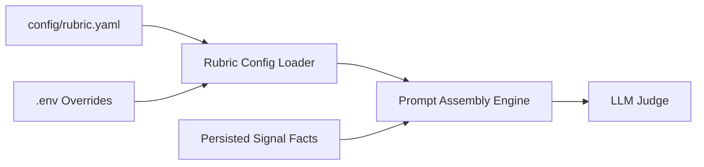
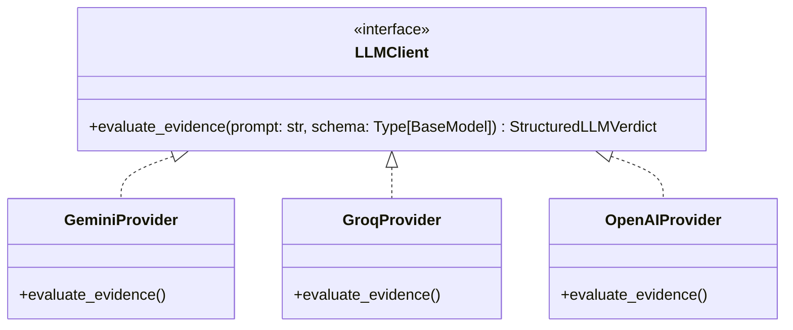
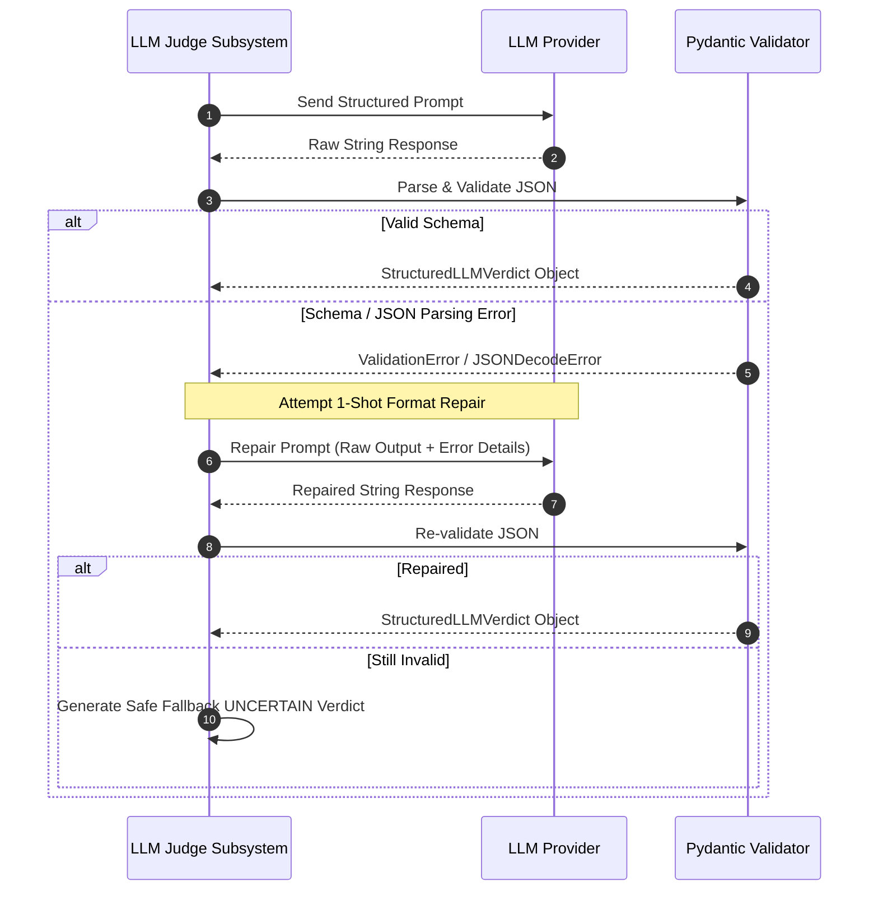

# LLM Judge Subsystem Specification

> **Status:** Approved Component Specification  
> **Architecture Reference:** [`docs/ARCHITECTURE.md`](file:///c:/Users/Lenovo/Desktop/company-intelligent%20agent/docs/ARCHITECTURE.md)  
> **Pipeline Reference:** [`docs/PIPELINE.md`](file:///c:/Users/Lenovo/Desktop/company-intelligent%20agent/docs/PIPELINE.md)  
> **Enrichment Reference:** [`docs/ENRICHMENT_SPEC.md`](file:///c:/Users/Lenovo/Desktop/company-intelligent%20agent/docs/ENRICHMENT_SPEC.md)

---

## 1. Subsystem Overview & Architectural Boundary

The **LLM Judge Subsystem** functions strictly as an analytical evaluation engine. 

### Critical Operational Boundary
- **NO Web Research:** The LLM is NEVER responsible for browsing the web, executing HTTP queries, or retrieving live external data.
- **Pure Evidence Synthesis:** The LLM receives only:
  1. Company identification metadata (Name, URL).
  2. Pre-extracted, structured facts persisted from the **Enrichment Subsystem** (HTTP, Browser, DNS/Meta).
  3. The **Configurable Evaluation Rubric**.
- **Deterministic Staging:** Evidence must already be validated and persisted in PostgreSQL before the LLM Judge is invoked.

```
┌─────────────────────────────────────────────────────────────────────────────┐
│                           LLM JUDGE ISOLATION                               │
│                                                                             │
│  ┌─────────────────────────────────┐                                        │
│  │   PostgreSQL (signals table)    │                                        │
│  │  - HTTP Website Facts           │                                        │
│  │  - Playwright Careers Facts     │                                        │
│  │  - External DNS / Meta Facts    │                                        │
│  └────────────────┬────────────────┘                                        │
│                   │                                                         │
│                   ▼                                                         │
│  ┌─────────────────────────────────┐    ┌────────────────────────────────┐  │
│  │      Configurable Rubric        │───▶│       LLM Judge Subsystem      │  │
│  │  (config/rubric.yaml / .env)    │    │ (Prompt Builder & Validations) │  │
│  └─────────────────────────────────┘    └───────────────┬────────────────┘  │
│                                                         │                   │
│                                                         ▼                   │
│                                         ┌────────────────────────────────┐  │
│                                         │      LLM Inference Provider    │  │
│                                         │    (Gemini / Groq / OpenAI)    │  │
│                                         └───────────────┬────────────────┘  │
│                                                         │                   │
│                                                         ▼                   │
│                                         ┌────────────────────────────────┐  │
│                                         │    Validated Verdict Schema    │  │
│                                         │     (fit, confidence, etc.)    │  │
│                                         └────────────────────────────────┘  │
└─────────────────────────────────────────────────────────────────────────────┘
```

---

## 2. Structured Output Schema Contract

The LLM Judge output must strictly adhere to the following Pydantic schema:

```python
from enum import Enum
from typing import List, Optional
from pydantic import BaseModel, Field, conlist

class FitDecision(str, Enum):
    YES = "YES"
    NO = "NO"
    UNCERTAIN = "UNCERTAIN"

class StructuredLLMVerdict(BaseModel):
    fit: FitDecision = Field(
        ...,
        description="Categorical fit verdict: YES (meets criteria), NO (disqualified/does not meet), UNCERTAIN (insufficient data)"
    )
    confidence: float = Field(
        ...,
        ge=0.0,
        le=1.0,
        description="Confidence score from 0.0 (no confidence) to 1.0 (absolute certainty)"
    )
    reasoning: conlist(str, min_length=1) = Field(
        ...,
        description="List of distinct, evidence-based deductive statements citing supplied facts"
    )
    follow_up_question: Optional[str] = Field(
        None,
        description="Targeted discovery question to clarify ambiguity or missing evidence"
    )
```

---

## 3. Configurable Fit Evaluation Architecture

Because the project task **does NOT define specific business fit criteria**, no business assumptions or static rules are hardcoded into the application.



### 3.1 Configuration Locations
The evaluation criteria are decoupled into configuration files and environment variables:
1. **Primary Config File:** `config/rubric.yaml`
2. **Environment Overrides:** `.env` variables (`FIT_TARGET_PROFILE`, `FIT_MIN_CONFIDENCE`, etc.)

### 3.2 Rubric Schema (`config/rubric.yaml` Structure)
```yaml
version: "1.0.0"
rubric_name: "Default Configurable Rubric"
description: "Configurable criteria definition for evaluating company fit."

# Target profile definition
target_criteria:
  industry_focus: "B2B Software / Enterprise Technology"
  target_offerings: "Cloud solutions, developer tools, or AI-enabled workflows"
  team_size_indicators: "Active engineering hiring, structured career portal"
  
# Explicit indicators
positive_signals:
  - "Explicit B2B value propositions or enterprise pricing tiers"
  - "Active technical job openings (Software, Engineering, AI/ML)"
  - "Standard corporate domain infrastructure (verified DNS, enterprise mail)"

disqualifying_signals:
  - "Direct-to-consumer (B2C) physical retail / eCommerce without B2B software"
  - "Personal blogs, dormant landing pages, or parked domains"
  - "Missing or dead websites"

# Confidence guidelines
confidence_guidelines:
  all_signals_concordant: 0.90
  missing_browser_signal: 0.65
  contradictory_signals: 0.40
```

---

## 4. Prompt Engineering Principles & Template

### 4.1 Core Prompt Principles
1. **Reason Strictly from Supplied Evidence:** Every statement in `reasoning` must directly reference a specific fact provided in the input payload.
2. **Zero Hallucination Tolerance:** Do not extrapolate or assume external market data, funding rounds, or features not present in the supplied signals.
3. **Distinguish Facts from Inferences:** Explicitly label factual observations (e.g. *"Careers page lists 4 active Python engineer roles"*) versus deductions (e.g. *"This indicates an expanding backend engineering team"*).
4. **Calibrate Confidence:** If evidence is thin (e.g., only static meta tags available), cap confidence accordingly.
5. **Constructive Follow-up Questions:** When evidence is ambiguous or incomplete, generate a high-value discovery question that an operator or sales rep can ask on a discovery call.

### 4.2 System Prompt Template
```
You are the Lead Company Evaluation Judge in an automated intelligence pipeline.
Your job is to evaluate whether a target company is a "FIT" based EXCLUSIVELY on the supplied evidence signals and the provided evaluation rubric.

RULES:
1. Base all reasoning ONLY on the extracted facts provided in the prompt.
2. Do NOT invent facts or assume information outside the supplied evidence.
3. Distinguish clearly between direct observations and logical deductions.
4. Output MUST strictly follow the JSON schema contract provided.
5. If the evidence is contradictory or insufficient to make a definitive call, set fit to "UNCERTAIN" and generate a specific "follow_up_question".
```

### 4.3 User Prompt Template
```
Evaluate the following company against the configured evaluation rubric:

### CONFIGURABLE EVALUATION RUBRIC
{rubric_yaml}

### TARGET COMPANY IDENTIFIERS
- Name: {company_name}
- Target URL: {website_url}

### EXTRACTED EVIDENCE SIGNALS
1. HTTP Website Signal:
{http_facts_json}

2. Browser Automation (Careers/Jobs) Signal:
{browser_facts_json}

3. External Infrastructure (DNS/Security) Signal:
{external_facts_json}

### INSTRUCTIONS
Synthesize the above signals and return a structured JSON verdict with fields:
- "fit": "YES" | "NO" | "UNCERTAIN"
- "confidence": Float between 0.0 and 1.0
- "reasoning": Array of concise, evidence-grounded deduction statements
- "follow_up_question": String inquiry for next steps (or null if not applicable)
```

---

## 5. Model Abstraction Layer (`LLMClient`)

To prevent vendor lock-in and enable seamless switching between free-tier providers (Google Gemini, Groq, OpenAI), the system uses a decoupled interface:



### Supported Free-Tier Providers
| Provider | Default Model | Structured Output Method | Advantages |
| :--- | :--- | :--- | :--- |
| **Google Gemini** | `gemini-1.5-flash` | Native `response_schema` (Pydantic / JSON schema) | High free-tier RPM, large context window. |
| **Groq Cloud** | `llama-3.3-70b-versatile` | JSON Object mode with system schema constraint | Ultra-fast inference (<500ms), zero cost. |
| **OpenAI** | `gpt-4o-mini` | `response_format={"type": "json_schema"}` | Highly reliable schema compliance. |

---

## 6. Structured Output Validation & Error Recovery



### 6.1 Fallback Verdict Generation
If the LLM repeatedly fails validation or the provider experiences a complete outage:
```python
def create_fallback_verdict(company_id: UUID, error_reason: str) -> StructuredLLMVerdict:
    return StructuredLLMVerdict(
        fit=FitDecision.UNCERTAIN,
        confidence=0.0,
        reasoning=[
            f"Automated evaluation could not be completed due to provider failure: {error_reason}",
            "Raw signals remain securely persisted in PostgreSQL for manual audit or automated retry."
        ],
        follow_up_question="Manual review required: please inspect raw company signals."
    )
```

---

## 7. Token Limits & Evidence Size Budgeting

To guarantee execution within free-tier rate limits and prevent context overflow, evidence payloads are bounded:

| Resource Boundary | Maximum Allowance | Enforcement Strategy |
| :--- | :--- | :--- |
| **Total Prompt Token Budget** | 4,000 tokens (~16,000 chars) | Pre-truncation of long text fields before prompt assembly. |
| **Per-Signal Fact Cap** | 1,200 tokens (~4,800 chars) | Body text and career descriptions truncated to high-value snippets. |
| **Max Output Tokens** | 800 tokens | Explicit `max_tokens=800` parameter on LLM client. |
| **Reasoning List Length** | 3 to 6 statements | Enforced in prompt instructions and validated via Pydantic. |

---

## 8. Provider Resilience & Retry Matrix

| Failure Mode | HTTP / API Code | Retry Policy | Exponential Backoff | Max Attempts |
| :--- | :--- | :--- | :--- | :--- |
| **Rate Limit / Quota** | `429 Too Many Requests` | Exponential Backoff + Jitter | `base=2s`, `max=16s` | 3 |
| **Provider Server Error**| `500`, `503 Service Unavailable` | Immediate retry with jitter | `base=1s`, `max=8s` | 2 |
| **Malformed JSON** | Client-side decode error | Targeted repair re-prompt | N/A | 1 |
| **Network Timeout** | Socket / Read Timeout (30s) | Reconnect & retry | `base=2s` | 2 |

---
*End of LLM Judge Specification.*
