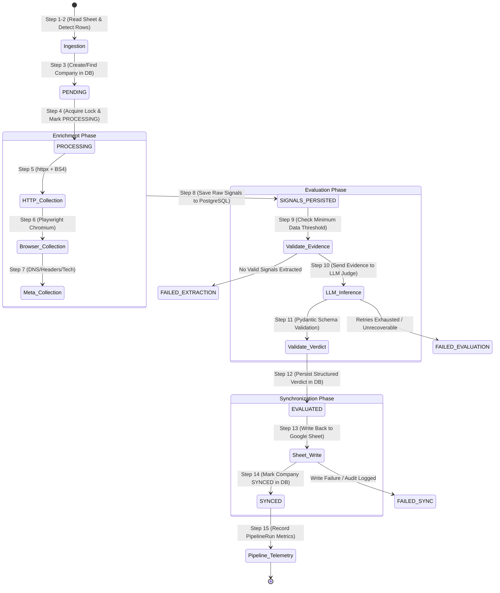

# Company Processing Pipeline Specification

> **Status:** Approved Operational Pipeline Specification  
> **Architecture Reference:** [`docs/ARCHITECTURE.md`](file:///c:/Users/Lenovo/Desktop/company-intelligent%20agent/docs/ARCHITECTURE.md)  
> **System Requirements:** [`docs/PROJECT_SPEC.md`](file:///c:/Users/Lenovo/Desktop/company-intelligent%20agent/docs/PROJECT_SPEC.md)

---

## 1. Pipeline Overview & Lifecycle State Machine

The pipeline processes company records ingested from Google Sheets through a 15-step deterministic lifecycle. Every company progresses through strict database state transitions to guarantee reliability, auditability, and recovery in case of system failures.



---

## 2. Step-by-Step Lifecycle Specification

```
┌─────────────────────────────────────────────────────────────────────────────┐
│                       15-STEP COMPANY PROCESSING FLOW                       │
│                                                                             │
│   [ 1. Read Sheet ] ──▶ [ 2. Detect New/Unprocessed ] ──▶ [ 3. Create/Find ]│
│                                                                    │        │
│   [ 6. Playwright ] ◀── [ 5. HTTP Fetch ] ◀── [ 4. Mark PROCESSING ]       │
│          │                                                                  │
│          ▼                                                                  │
│   [ 7. Meta/DNS ] ──▶ [ 8. Persist Signals ] ──▶ [ 9. Validate Evidence ]   │
│                                                            │                │
│   [ 12. Save Verdict ] ◀── [ 11. Validate LLM ] ◀── [ 10. LLM Judge ]       │
│          │                                                                  │
│          ▼                                                                  │
│   [ 13. Sync to Sheet ] ──▶ [ 14. Mark SYNCED ] ──▶ [ 15. Record Run ]      │
└─────────────────────────────────────────────────────────────────────────────┘
```

### Step 1: Read Google Sheet
- **Action:** Authenticate with the Google Sheets API v4 using a Service Account credential and fetch all populated rows from the designated input worksheet.
- **Data Extracted:** Row index, company name, target website URL, user-provided metadata, and current status column value.
- **Constraints:** Respect API read quotas (batch requests to read the entire range in a single API call).

### Step 2: Identify Unprocessed / New Rows
- **Action:** Filter rows to determine which companies require processing:
  - Rows with an empty or `PENDING` status.
  - Rows where the company URL has changed compared to previously recorded database records.
  - Rows flagged for explicit re-evaluation.
- **Outcome:** A prioritized list of un-evaluated company payloads.

### Step 3: Create or Find Company in Database
- **Action:** Look up the company in PostgreSQL by normalized website domain (or URL hash).
  - If existing: retrieve company UUID and check historical status.
  - If new: insert a new `companies` record with `status = 'PENDING'`.
- **Database Entity:** `companies` table.

### Step 4: Mark PROCESSING
- **Action:** Atomically update the company's status in PostgreSQL:
  ```sql
  UPDATE companies 
  SET status = 'PROCESSING', updated_at = NOW() 
  WHERE id = :company_id AND status IN ('PENDING', 'FAILED_RETRYABLE');
  ```
- **Purpose:** Prevents duplicate concurrent execution across worker threads or overlapping pipeline runs.

### Step 5: Collect HTTP Evidence (Fast Collector)
- **Engine:** `httpx.AsyncClient` + `BeautifulSoup4`.
- **Action:** 
  - Send asynchronous HTTP GET to the company's homepage.
  - Follow redirects to capture canonical URL.
  - Parse static HTML for title, meta description, OpenGraph tags, schema.org JSON-LD, navigation links, and primary body text.
- **Timeout:** 10 seconds.

### Step 6: Collect Browser Automation Evidence (Playwright Collector)
- **Engine:** Headless Chromium via `Playwright`.
- **Action:**
  - Launch isolated browser context.
  - Navigate to target URL with `wait_until='domcontentloaded'`.
  - Wait for client-side JavaScript hydration (SPAs, React/Vue/Next.js).
  - Extract dynamic DOM text, interactive pricing tiers, feature lists, and rendered client-side components.
- **Timeout:** 20 seconds.

### Step 7: Collect Additional Independent Evidence (Metadata/DNS)
- **Engine:** Python `dns.resolver` / HTTP header inspect.
- **Action:**
  - Extract TLS/SSL certificate issuer and validity.
  - Resolve DNS MX/TXT records and identify email/cloud providers.
  - Parse HTTP security headers (`Content-Security-Policy`, `Strict-Transport-Security`, `Server`).
- **Purpose:** Independent third-source signal confirming company technical footprint and operational legitimacy.

### Step 8: Persist Raw Signals in PostgreSQL
- **CRITICAL ARCHITECTURAL RULE:** **All raw evidence must be staged and committed to PostgreSQL *before* invoking the LLM Judge.**
- **Action:** Insert extracted data into the `signals` table with `jsonb` payloads:
  - Signal Type (`HTTP_HTML`, `BROWSER_DOM`, `DNS_METADATA`).
  - Source URL and extraction timestamp.
  - Cleaned text facts, structured metadata, and error traces (if any signal failed).
- **Benefit:** Full audit trail, reproducibility, zero loss of expensive scraped data if the LLM fails, and ability to re-evaluate without re-crawling.

### Step 9: Validate Minimum Evidence Threshold
- **Action:** Inspect persisted signals before calling the LLM:
  - Verify that at least one primary signal (HTTP or Browser DOM) succeeded and produced meaningful textual facts (>50 characters).
  - If all signal extractors failed (e.g., dead domain, DNS NXDOMAIN, SSL handshake error): abort LLM call, mark company `FAILED_EXTRACTION`, record failure reason, and skip to Step 13.

### Step 10: Send Evidence to LLM Judge
- **Action:**
  - Compile the cleaned, structured facts from all persisted signals.
  - Inject the **Configurable Evaluation Rubric** and target ICP parameters.
  - Dispatch structured prompt to LLM inference provider (Gemini / Groq / OpenAI).
- **Prompt Strategy:** Request rigorous multi-step evidence reasoning rather than surface summarization.

### Step 11: Validate Structured LLM Response
- **Engine:** `Pydantic v2` schema validation.
- **Action:** Parse and strictly validate the JSON response:
  - `fit_call`: Allowed enum (`STRONG_FIT`, `MODERATE_FIT`, `NOT_A_FIT`, `INSUFFICIENT_DATA`).
  - `confidence_score`: Float between `0.0` and `1.0`.
  - `confidence_rationale`: Text explanation of score confidence.
  - `evidence_reasoning`: Array of deductive reasoning steps citing specific extracted facts.
  - `follow_up_question`: Targeted question for discovery calls.
- **Recovery:** If response fails JSON parsing or validation, trigger automated format repair retry (up to 2 retries).

### Step 12: Persist Structured Verdict in PostgreSQL
- **Action:** Insert validated evaluation into the `verdicts` table:
  - Foreign key link to `company_id`.
  - Fit call, confidence score, rationale, reasoning chain, follow-up question.
  - Rubric version hash (for tracking prompt/criteria iterations).
  - Set company status to `EVALUATED`.

### Step 13: Synchronize Verdict to Google Sheet
- **Action:** Authenticate with Google Sheets API and update the specific company row:
  - Status: `EVALUATED` (or `FAILED`).
  - Fit Call (e.g., `STRONG_FIT`).
  - Confidence Score (e.g., `0.92`).
  - Follow-up Question.
  - Summary / Reasoning snippet.
  - Last Evaluated Timestamp.
- **Rate-Limiting:** Batched updates to avoid Google quota throttling.

### Step 14: Mark Company SYNCED in PostgreSQL
- **Action:** Update company status:
  ```sql
  UPDATE companies 
  SET status = 'SYNCED', updated_at = NOW() 
  WHERE id = :company_id;
  ```
- **Audit:** Record success record in `sync_logs` table.

### Step 15: Record PipelineRun Telemetry
- **Action:** Record aggregate execution metadata in `pipeline_runs` table:
  - Run ID, trigger type (`SCHEDULED`, `ON_DEMAND_API`, `GITHUB_ACTIONS`).
  - Total companies processed, successful syncs, failed extractions, failed evaluations.
  - Total duration (milliseconds) and token consumption metrics.

---

## 3. Resilience, Fault Tolerance & Error Handling Matrix

```mermaid
flowchart TD
    Start[Run Step for Company] --> StepCheck{Which Step?}

    %% Signal Collection Failure
    StepCheck -->|Step 5, 6, or 7| Scrape[Signal Collection]
    Scrape --> ScrapeError{Collector Error?}
    ScrapeError -- Single Collector Fails --> Degrade[Log Warning -> Store Partial Signal in DB]
    Degrade --> Step8[Proceed to Step 8: Persist Available Signals]
    ScrapeError -- All Collectors Fail --> MarkExtractFail[Mark FAILED_EXTRACTION in DB]
    MarkExtractFail --> SyncFail[Write Extraction Error to Google Sheet]

    %% LLM Failure
    StepCheck -->|Step 10 or 11| LLMCall[LLM Judge Call]
    LLMCall --> LLMError{LLM Error Type?}
    LLMError -- 429 Rate Limit --> BackoffLLM[Exponential Backoff + Jitter Retry (Max 3)]
    BackoffLLM --> LLMCall
    LLMError -- Malformed JSON --> RepairPrompt[Send Correction Prompt to LLM (Max 2)]
    RepairPrompt --> LLMCall
    LLMError -- Permanent 5xx / Retries Exhausted --> FallbackVerdict[Store Fallback INSUFFICIENT_DATA in DB]
    FallbackVerdict --> Step13[Proceed to Step 13: Sync Fallback to Sheet]

    %% Google Sheets Failure
    StepCheck -->|Step 1 or 13| GSheets[Google Sheets API]
    GSheets --> GError{Sheets API Error?}
    GError -- 429 Quota Exceeded --> WaitQuota[Backoff 60s & Retry Batch]
    WaitQuota --> GSheets
    GError -- Auth Expired --> RefreshAuth[Refresh OAuth Token & Retry]
    RefreshAuth --> GSheets
    GError -- Unrecoverable --> LogSyncFail[Log SYNC_FAILED in DB -> Alert Operator]

    %% Database Failure
    StepCheck -->|Step 3, 4, 8, 12, 14| DBDriver[PostgreSQL Operation]
    DBDriver --> DBError{DB Error?}
    DBError -- Deadlock / Connection Drop --> DBRetry[Reacquire Connection & Retry Tx (Max 3)]
    DBRetry --> DBDriver
    DBError -- Constraint Violation --> Rollback[Rollback Transaction & Log Error]
```

### 3.1 Failure Scenario Details

| Failure Domain | Potential Cause | System Response & Mitigation Strategy | Final State |
| :--- | :--- | :--- | :--- |
| **Partial Signal Failure** | Playwright crashes on heavy SPA or encounters Cloudflare challenge. | HTTP and DNS signals are captured; error trace logged in `signals` table. LLM receives partial data with notice of missing browser signal. | `SYNCED` *(with lower confidence)* |
| **Complete Extraction Failure** | Domain dead, DNS NXDOMAIN, SSL handshake error on all collectors. | Step 9 halts pipeline before LLM call (saving API tokens). Database records extraction error. | `FAILED_EXTRACTION` written to Sheet |
| **LLM Rate Limit (429)** | Free-tier RPM or TPM ceiling hit on LLM API provider. | Asynchronous exponential backoff with random jitter (`retry_after` header respected, up to 3 retries). | Recovers to `EVALUATED` |
| **LLM Output Schema Error** | Model returns invalid JSON or missing required fields. | Automated Pydantic validation catches failure; formatting repair prompt is dispatched (max 2 attempts). | Recovers or logs `FAILED_EVALUATION` |
| **Browser Crash / OOM** | Playwright Chromium exceeds free-tier RAM container limits. | Browser process sandbox isolation ensures main FastAPI process does not crash. Process killed, caught in `try/except`, partial HTTP signals used. | Handled gracefully via partial fallback |
| **Google Sheets API Quota (429)** | Exceeded 300 requests/min per project quota. | Write operations are grouped into batch updates. Requests throttled with sleep intervals. | Recovers to `SYNCED` |
| **Google Auth Token Expiry** | Expired service account delegation or token invalidation. | Automatic credential refresh via Google Auth library. If credentials file is invalid, alert logged. | Retries or halts batch safely |
| **Database Connection Drop** | Managed PostgreSQL idle disconnect or network blip. | SQLAlchemy connection pool recycling (`pool_pre_ping=True`) automatically re-establishes dropped connections. | Transparently retried |

---

## 4. Execution Guarantees & Concurrency Controls

### 4.1 Idempotency
- **Deterministic Re-runs:** Running the pipeline multiple times on the same Google Sheet row will not produce duplicate companies or duplicate active verdicts.
- **Signal & Verdict Versioning:** Each new run creates a new versioned evaluation linked to the company, preserving the complete historical timeline while updating the company's `latest_verdict_id`.
- **Sheet Cell Writes:** Write operations target specific cells mapped by row index/ID, ensuring repeat writes overwrite cleanly rather than appending phantom rows.

### 4.2 Duplicate Execution Prevention
- **Row & Domain Hashing:** Ingested companies are deduplicated using normalized domain keys (e.g., `https://www.example.com/` → `example.com`).
- **Atomic State Acquisition:** When a worker picks up a company, it executes an atomic state transition:
  ```sql
  UPDATE companies 
  SET status = 'PROCESSING', lease_expires_at = NOW() + INTERVAL '5 minutes'
  WHERE id = :company_id AND (status = 'PENDING' OR lease_expires_at < NOW());
  ```
- If another trigger attempts to process the same company simultaneously, the query affects 0 rows, and the second worker skips it.

### 4.3 Concurrent Execution Control
- **Batch Throttling:** Ingestion is chunked into configurable batches (e.g., 5 companies per batch) to adhere to container memory (RAM) constraints during Playwright browser execution.
- **Resource Semaphore:** A global `asyncio.Semaphore(max_concurrent_browsers=2)` restricts how many headless Chromium instances run simultaneously, preventing container out-of-memory (OOM) faults on free-tier hosting.

### 4.4 Timeout Policies

| Operation | Default Timeout | Enforcement Mechanism |
| :--- | :--- | :--- |
| **Google Sheets Read/Write** | 15 seconds | `httpx` / Google API client socket timeout |
| **HTTP Scrape (`httpx`)** | 10 seconds | `httpx.Timeout(10.0, connect=5.0)` |
| **Playwright Browser Navigation** | 20 seconds | `page.goto(url, timeout=20000)` |
| **Playwright DOM Hydration** | 5 seconds | `page.wait_for_load_state("domcontentloaded", timeout=5000)` |
| **LLM Inference Request** | 30 seconds | API client timeout |
| **Total Single-Company Budget** | 75 seconds | `asyncio.wait_for(process_company(), timeout=75.0)` |

---
*End of Pipeline Specification.*
