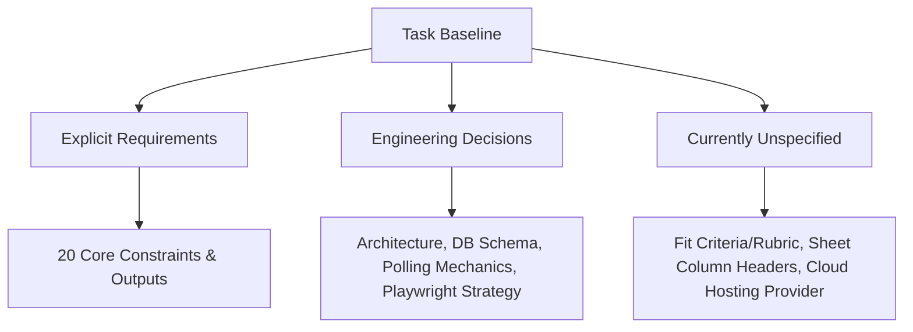
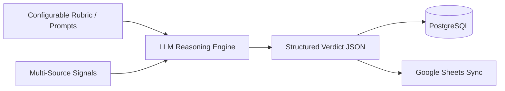
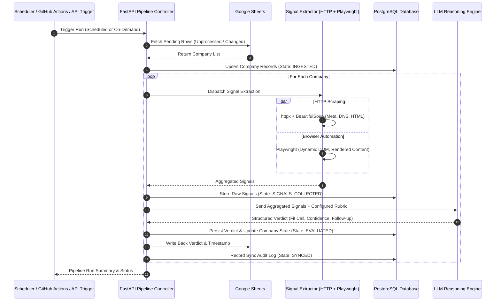
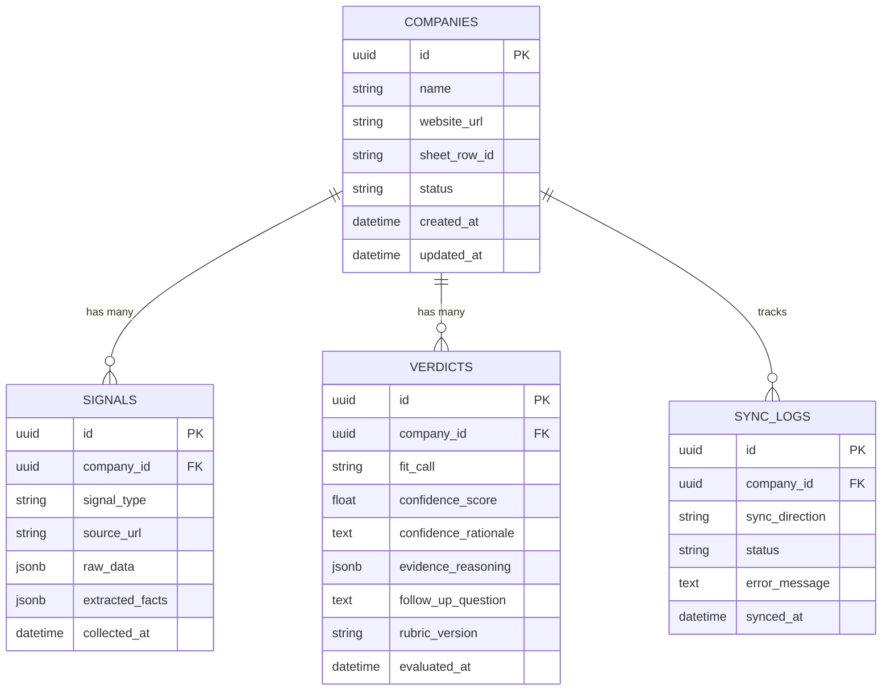

# Project Specification: Autonomous Company Intelligence Agent

> **Status:** Draft / Ground Truth Specification  
> **Target System:** Company Intelligence & Signal Extraction Pipeline  
> **Document Role:** Single Source of Truth for System Requirements, Architecture, and Operational Constraints

---

## 1. Executive Summary & Objective

The **Company Intelligence Agent** is an automated pipeline designed to ingest companies from a Google Sheet, collect multi-source signals (including live browser automation), synthesize structured evaluation verdicts via a reasoning Large Language Model (LLM), persist all operational state and evidence in a relational database, and synchronize the results back to Google Sheets.

The system supports scheduled runs, on-demand execution, queryable REST API endpoints, containerized deployment on free-tier infrastructure, and automated GitHub Actions workflows.

---

## 2. Core Project Requirements (Baseline)

The following 20 requirements define the functional and operational scope of the project:

| ID | Requirement | Category |
| :--- | :--- | :--- |
| **REQ-01** | A Google Sheet contains a list of companies. | Ingestion / Data Source |
| **REQ-02** | New rows must be picked up without restarting the application. | Dynamic Ingestion |
| **REQ-03** | The system must collect multiple independent signals for each company. | Signal Collection |
| **REQ-04** | At least one signal must come from real browser automation rather than a plain HTTP request. | Browser Automation |
| **REQ-05** | Results must be persisted in a real database. | Persistence |
| **REQ-06** | The database must not be replaced by Google Sheets (DB is the system of record). | Architecture / Data Integrity |
| **REQ-07** | An LLM must turn the collected signals into a structured verdict. | LLM Processing |
| **REQ-08** | The verdict must contain: `fit call`, `confidence`, and `follow-up question`. | Output Contract |
| **REQ-09** | The LLM must reason over evidence rather than simply summarize. | Reasoning & Synthesis |
| **REQ-10** | The verdict must be synchronized back into Google Sheets using proper authentication. | Data Synchronization |
| **REQ-11** | The pipeline must run on a schedule. | Automation / Scheduling |
| **REQ-12** | The pipeline must be triggerable on demand (via API / workflow). | On-Demand Trigger |
| **REQ-13** | The pipeline must be queryable on demand (status, results, evidence). | Queryability / API |
| **REQ-14** | The application must be containerized (Docker). | Packaging / Containerization |
| **REQ-15** | The application must be deployed and reachable through a real, public URL. | Deployment |
| **REQ-16** | GitHub Actions must check the code (lint/test) on every push. | CI/CD |
| **REQ-17** | A separate GitHub Actions workflow must be able to automatically trigger the pipeline. | CI/CD Automation |
| **REQ-18** | Only free-tier tools and credits may be used across all services and infrastructure. | Budget & Constraints |
| **REQ-19** | A Git repository and comprehensive README are required. | Documentation & Code Delivery |
| **REQ-20** | A 3–5 minute demo video is required demonstrating end-to-end functionality. | Demonstration / Verification |

---

## 3. Requirement Classification Matrix

To maintain strict adherence to project boundaries, system aspects are categorized into what is **explicitly required**, what is an **engineering decision**, and what is **currently unspecified**.



### 3.1 What is Explicitly Required
- Ingestion from Google Sheets with dynamic discovery of new rows without application restarts.
- Multiple independent signals per company, with at least one signal collected using genuine headless browser automation (Playwright).
- Relational database persistence (PostgreSQL) where the database maintains full state and is never bypassed or replaced by Google Sheets.
- LLM-powered evidence reasoning engine generating a structured verdict containing:
  - **Fit Call** (categorical verdict)
  - **Confidence** (quantified or calibrated score)
  - **Follow-up Question** (actionable discovery question)
- Bi-directional synchronization: reading input rows and writing verdicts/timestamps back to the Google Sheet using authenticated Google Service Account / OAuth credentials.
- Scheduling capabilities + On-demand trigger endpoint + Queryable REST API endpoints.
- Dockerized container deployment accessible over a public URL.
- GitHub Actions CI (lint/test on push) + manual/automated pipeline trigger workflow.
- Exclusively free-tier tools and hosting.
- Demo video (3–5 min), Git repository, and comprehensive README.

### 3.2 What is an Engineering Decision
- **API Framework:** FastAPI with asynchronous request handling.
- **ORM & Migrations:** SQLAlchemy (2.0 async / sync engine) paired with Alembic for database schema versioning.
- **Data Validation & Schemas:** Pydantic v2 models for signal schemas, LLM structured outputs, and API request/response validation.
- **Signal Collection Engine:**
  - Fast HTTP scraping: `httpx` + `BeautifulSoup4` for static content, metadata, and robots/headers.
  - Browser automation: `Playwright` (headless Chromium) for dynamic JavaScript rendering, interactive element scraping, and visual/DOM signal extraction.
- **Ingestion Architecture:** Row-level hash/timestamp change-detection or status-column tracking to detect new rows without application restarts.
- **Relational Data Model:** Normalized entities for `Company`, `SignalSource`, `RawSignal`, `Verdict`, and `SyncLog`.
- **Exclusion of External Scraping APIs:** `Firecrawl` is explicitly excluded; all extraction is implemented in-house via `httpx`, `BeautifulSoup`, and `Playwright`.

### 3.3 What is Currently Unspecified
- **Specific Business Fit Criteria:** The exact criteria that determine whether a company is a "fit" (e.g., target industry, revenue, B2B/B2C focus, technology stack, hiring status) are not specified. **The system must therefore treat fit criteria as configurable.**
- **Google Sheet Column Layout:** The exact column names and sheet structure (e.g., "Company Name", "Website", "Status", "Fit Call", "Confidence", "Follow-up Question") are not fixed and must be configurable or mapped via configuration.
- **Target Free-Tier Cloud Host:** The specific deployment platform (e.g., Render, Railway, Fly.io, Koyeb, AWS Free Tier) is open, provided it supports Docker, PostgreSQL, and a public URL.
- **Specific LLM Provider & Model:** The LLM provider (e.g., Google Gemini Free Tier / OpenAI API credit / Groq / OpenRouter / Anthropic) is not hardcoded and will be abstracted via an interface.

---

## 4. Configurable Fit Evaluation System

Because the task does not define the business criteria for determining a "fit", **no business assumptions or static rules will be hardcoded**. Instead, the evaluation subsystem is designed around a **Configurable Evaluation Rubric**.



### 4.1 Verdict Schema Contract
The output of the evaluation engine must strictly conform to the following Pydantic contract:

```python
class FitCallEnum(str, Enum):
    STRONG_FIT = "STRONG_FIT"
    MODERATE_FIT = "MODERATE_FIT"
    NOT_A_FIT = "NOT_A_FIT"
    INSUFFICIENT_DATA = "INSUFFICIENT_DATA"

class CompanyVerdict(BaseModel):
    company_id: str
    fit_call: FitCallEnum
    confidence_score: float  # Range: 0.0 to 1.0
    confidence_rationale: str
    evidence_reasoning: List[str]  # Detailed chain of evidence, not mere summary
    key_signals_used: List[str]
    follow_up_question: str  # Critical inquiry for next steps / discovery
    evaluated_at: datetime
```

### 4.2 Configuration Mechanism
- **Rubric Configuration:** Stored in environment variables or configuration files (`config/rubric.yaml` / `.env`), specifying:
  - Target company profile description (e.g., ICP definition).
  - Positive indicators (signals that increase fit).
  - Negative indicators / disqualified attributes.
  - Confidence weighting guidelines.
- **Prompt Templates:** Decoupled prompt templates that inject raw signals and configured criteria into the LLM reasoning prompt.

---

## 5. Technology Stack Specification

The system stack is strictly defined as follows:

| Layer / Role | Technology | Justification & Purpose |
| :--- | :--- | :--- |
| **Language** | Python 3.11+ | Primary ecosystem for modern asynchronous APIs, LLM integration, and web automation. |
| **API Framework** | FastAPI | High-performance asynchronous REST API for triggering runs, querying data, and health checks. |
| **Relational Database** | PostgreSQL | Robust ACID storage for companies, raw signals, verdicts, and audit logs. |
| **ORM** | SQLAlchemy (2.0+) | Type-safe SQL abstraction, entity relationship mapping, and async session management. |
| **Migrations** | Alembic | Version-controlled database schema migrations. |
| **Validation & Schemas** | Pydantic v2 | Strict data modeling, configuration loading, and LLM structured output parsing. |
| **Fast HTTP Client** | httpx | Asynchronous HTTP requests for APIs, static scraping, and metadata fetching. |
| **HTML Parsing** | BeautifulSoup4 | Extracting text, meta tags, and structured HTML elements from raw responses. |
| **Browser Automation** | Playwright | Headless Chromium engine for single-page applications (SPAs), dynamic DOM, and JavaScript rendering. |
| **External Integration** | Google Sheets API (v4) / gspread | Authenticated reading of input company queues and updating evaluation outputs. |
| **Inference Engine** | LLM API (e.g., Gemini API / OpenAI / Groq) | Zero-shot & few-shot structured evidence reasoning over aggregated company signals. |
| **Test Suite** | pytest / pytest-asyncio | Unit and integration test suite covering signal extractors, parsers, DB models, and API endpoints. |
| **Containerization** | Docker & Docker Compose | Multi-stage Dockerfile bundling Python runtime, Playwright system dependencies, and app code. |
| **CI/CD Automation** | GitHub Actions | Automated CI pipeline (linting, tests) and manual/scheduled workflow dispatch for pipeline triggering. |

> [!IMPORTANT]
> **Tool Exclusion Notice:** `Firecrawl` is explicitly excluded from the technology stack. All crawling and scraping logic must rely directly on `httpx`, `BeautifulSoup`, and `Playwright`.

---

## 6. System Architecture & Pipeline Workflow



---

## 7. Data Storage & Schema Design

PostgreSQL is the **single source of truth** for all historical runs, raw evidence, and generated verdicts. Google Sheets serves as an external interface for user input and executive summaries.



---

## 8. API Endpoints & Operational Interfaces

The FastAPI service exposes the following operational interfaces:

| Method | Endpoint | Description |
| :--- | :--- | :--- |
| `GET` | `/health` | Liveness and readiness probe (DB status, browser readiness). |
| `POST` | `/api/v1/pipeline/trigger` | Trigger an on-demand ingestion and evaluation cycle. |
| `GET` | `/api/v1/pipeline/status/{run_id}` | Check the progress and telemetry of an ongoing or completed run. |
| `GET` | `/api/v1/companies` | Query stored companies with pagination, status filters, and search. |
| `GET` | `/api/v1/companies/{id}` | Retrieve company details, all raw signals, and complete verdict history. |
| `GET` | `/api/v1/companies/{id}/verdict` | Fetch the latest structured evaluation verdict for a specific company. |
| `POST` | `/api/v1/companies/evaluate-direct` | On-demand evaluation for a single arbitrary company payload. |

---

## 9. CI/CD, Containerization & Deployment

### 9.1 Containerization (Docker)
- Multi-stage build minimizing image footprint.
- Headless Playwright browser runtime installation (`playwright install --with-deps chromium`).
- Non-root user execution for security.
- Environment-variable-driven configuration for database connection, Google credentials, and LLM keys.

### 9.2 GitHub Actions Workflows
1. **Continuous Integration (`ci.yml`):**
   - Triggers on every `push` and `pull_request` to `main`.
   - Runs `ruff` / `black` linting, `pytest` unit/integration test suite.
2. **Pipeline Trigger Workflow (`pipeline_trigger.yml`):**
   - Separate workflow with `workflow_dispatch` (manual trigger) and `schedule` (cron schedule) options.
   - Dispatches a secure API request to the deployed application's public URL to initiate a pipeline run.

### 9.3 Free-Tier Deployment Strategy
- Deployment target with zero-cost tier (e.g., Render Web Service + Managed PostgreSQL, Fly.io, or Railway free allowance).
- Persistent PostgreSQL instance for data retention.
- Publicly accessible HTTPS endpoint.

---

## 10. Verification & Quality Assurance Strategy

- **Unit Testing:**
  - Signal extractor parsers (HTML/DOM extraction logic).
  - Pydantic schema validation and LLM response sanitizers.
  - Configurable rubric engine logic.
- **Integration Testing:**
  - Mocked Google Sheets API interactions (read/write verification).
  - Mocked LLM API responses for deterministic evaluation verification.
  - Database transactions, rollbacks, and Alembic migration verification using test PostgreSQL containers or SQLite test equivalents.
- **End-to-End Testing:**
  - Live execution of sample test rows through ingestion -> extraction -> LLM evaluation -> DB storage -> Sheet sync.

---

## 11. Project Deliverables Checklist

- [ ] `docs/PROJECT_SPEC.md` (This document)
- [ ] Application Source Code (FastAPI, SQLAlchemy models, signal collectors, LLM evaluator, Google Sheets sync)
- [ ] Alembic database migrations
- [ ] Comprehensive test suite (`pytest`)
- [ ] Dockerfile and `docker-compose.yml`
- [ ] GitHub Actions workflows (`ci.yml` and `pipeline_trigger.yml`)
- [ ] Comprehensive `README.md` (Setup instructions, architecture diagram, API documentation, local running steps)
- [ ] Publicly deployed instance reachable via HTTPS
- [ ] 3–5 Minute Demo Video demonstrating scheduled, on-demand, browser automation, and sheet-sync capabilities

---

## 12. Open Decisions

The following architectural and operational decisions must be finalized prior to or during the execution phase:

| # | Decision Item | Alternatives Under Consideration | Impact / Trade-offs | Proposed Default |
| :--- | :--- | :--- | :--- | :--- |
| **OD-1** | **Default Evaluation Rubric Definition** | B2B SaaS fit, AI/Automation agency client fit, or Enterprise vendor fit. | Determines default prompt template and sample test data. | B2B SaaS ICP with configurable prompt override. |
| **OD-2** | **Google Sheet Schema & Column Mapping** | Fixed column index vs. dynamic header name lookup. | Dynamic header lookup allows flexible user sheets without breaking sync. | Dynamic header lookup with standard fallback names. |
| **OD-3** | **Free-Tier LLM Provider Selection** | Google Gemini API (Free tier RPM quota), Groq Cloud (Free Llama-3 inference), or OpenAI API credit. | Rate limits, token quotas, and structured output reliability. | Google Gemini 1.5 Flash or Groq Llama-3-70B via structured Pydantic output. |
| **OD-4** | **Browser Automation Target Signal** | Careers page scraping, interactive product demo/pricing widget, or tech stack detection. | Playwright execution time and headless resource consumption on free-tier containers. | Dynamic pricing/product feature inspection or interactive page elements. |
| **OD-5** | **Cloud Hosting Provider for Free Tier** | Render.com vs. Fly.io vs. Koyeb vs. Railway. | RAM limitations for running headless Chromium (Playwright requires ~300-500MB). | Render / Koyeb with lightweight Chromium configuration or remote browser runner. |
| **OD-6** | **Pipeline Concurrency Model** | Async asyncio task batching vs. Celery/Redis queue. | Celery requires an extra Redis container; asyncio background tasks fit in a single free-tier container. | FastAPI BackgroundTasks / asyncio worker within the single container. |

---
*End of Project Specification.*
